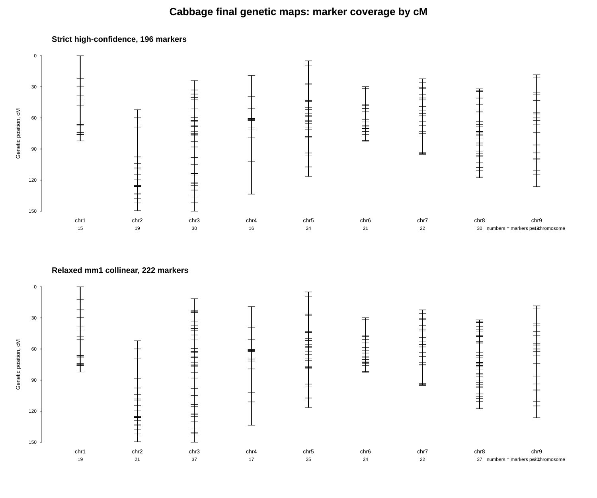
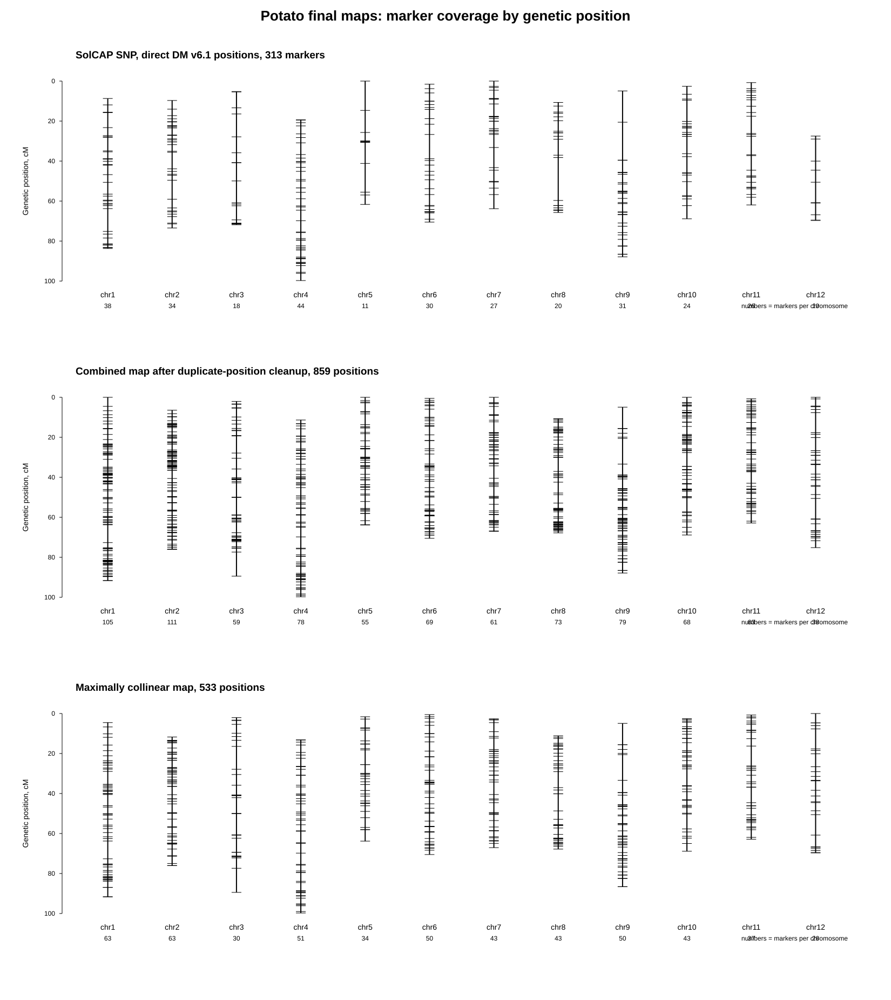

# Genetic maps

## Описание проекта

Цель проекта — получить для каждой культуры таблицу генетической карты в формате:

~~~text
chr    pos    cM
~~~

где:

- `chr` — хромосома в актуальной референсной сборке;
- `pos` — физическая позиция маркера;
- `cM` — генетическая координата маркера.

Для следующих культур:

- кукуруза — *Zea mays*;
- подсолнечник — *Helianthus annuus*;
- капуста белокочанная — *Brassica oleracea* var. *capitata*;
- рис — *Oryza sativa*;
- картофель — *Solanum tuberosum*;
- рапс — *Brassica napus*.

## Структура проекта

~~~text
genetic_maps_test_task/
├── README.md
└── species/
    ├── zea_mays/
    ├── helianthus_annuus/
    ├── brassica_oleracea_capitata/
    └── solanum_tuberosum/
~~~

Для каждой культуры структура однотипная:

~~~text
species/<species>/
├── data/             # исходные данные, маркеры, метаданные
├── scripts/          # скрипты анализа
├── results/
│   ├── intermediate/ # промежуточные таблицы
│   ├── final/        # финальные карты
│   ├── qc/           # QC-таблицы
│   └── figures/      # графики
└── logs/             # логи
~~~

## Краткая сводка по культурам

### 1. Кукуруза — *Zea mays*

Для кукурузы использовались данные MaizeGDB Genetic 1 для linkage groups LG1–LG10.  
Целевой референс: `GCF_902167145.1_Zm-B73-REFERENCE-NAM-5.0`.

Основная задача состояла в том, чтобы привести данные MaizeGDB к актуальной сборке и получить финальную таблицу с колонками `chr`, `pos`, `cM`.

Финальные результаты лежат в:

~~~text
species/zea_mays/results/final/
~~~

График покрытия генетической карты:

---

### 2. Подсолнечник — *Helianthus annuus*

Для подсолнечника использовались 25-bp SFP-маркеры из опубликованных данных.  
Целевой референс: `GCF_002127325.2_HanXRQr2.0-SUNRISE`.

Физические координаты маркеров были получены через выравнивание 25-bp последовательностей на референсный геном. В финальную карту вошли только однозначные хиты, соответствующие ожидаемой хромосоме.

Финальный результат: `21,442` markers.

Финальная карта:

~~~text
species/helianthus_annuus/results/final/sunflower_genetic_map.bwa_exact_unique.tsv
~~~

График покрытия генетической карты:

---

### 3. Капуста белокочанная — *Brassica oleracea* var. *capitata*

Для капусты использовалась опубликованная генетическая карта из SSR- и SNP/SNAP-маркеров.  
Целевой референс: `GCA_018177695.1_Cabbage_OX-heart_923_BVRC`.

Физические координаты определялись через выравнивание праймеров на референс и реконструкцию ампликонов. По итогам были собраны две версии карты: более строгая карта с однозначными хитами и карта с более мягким порогом.

Финальные результаты:

- strict / high-confidence map: `196` markers;
- relaxed mm1 collinear map: `222` markers.

Финальные карты лежат в:

~~~text
species/brassica_oleracea_capitata/results/final/
~~~

График покрытия генетической карты:

---

### 4. Картофель — *Solanum tuberosum*

Для картофеля использовалась генетическая карта из supplementary Table S4 работы Sharma et al. 2013.  
Целевой референс: `DM_1-3_516_R44_potato.v6.1`.

Основная сложность состояла в том, что генетические координаты маркеров были доступны в Table S4, но физические координаты в этой таблице относились к старой сборке `PGSC/DM v4.03`. Поэтому для построения карты на актуальной сборке использовались два подхода:

~~~text
SolCAP SNP
→ cM из Table S4
→ chr и pos напрямую из таблиц SpudDB для DM v6.1

DArT_marker / repeat_region / match
→ cM из Table S4
→ координаты на PGSC/DM v4.03 из Table S4
→ перенос координат на DM v6.1 через выравнивание старой и новой сборок
~~~

Для SolCAP SNP были использованы прямые физические координаты из SpudDB. Для остальных маркеров координаты были перенесены со старой сборки на новую с помощью выравнивания сборок `PGSC/DM v4.03` и `DM_1-3_516_R44_potato.v6.1` и переноса координат с учетом CIGAR.

Были получены несколько версий карты:

- строгая карта по SolCAP SNP с прямыми координатами на DM v6.1: `313` markers;
- объединенная карта после удаления повторяющихся физических позиций: `859` positions;
- максимально коллинеарная карта: `533` positions.

Основной расширенный результат:

~~~text
species/solanum_tuberosum/results/final/potato_genetic_map.hybrid_high_confidence.first_cM.max_collinear.tsv
~~~

Дополнительные файлы:

~~~text
species/solanum_tuberosum/results/final/potato_genetic_map.tsv
species/solanum_tuberosum/results/final/potato_genetic_map.hybrid_high_confidence.first_cM.tsv
species/solanum_tuberosum/results/qc/potato_max_collinear_summary.txt
species/solanum_tuberosum/results/qc/potato_max_collinear_removed_positions.tsv
~~~

График покрытия генетической карты:

