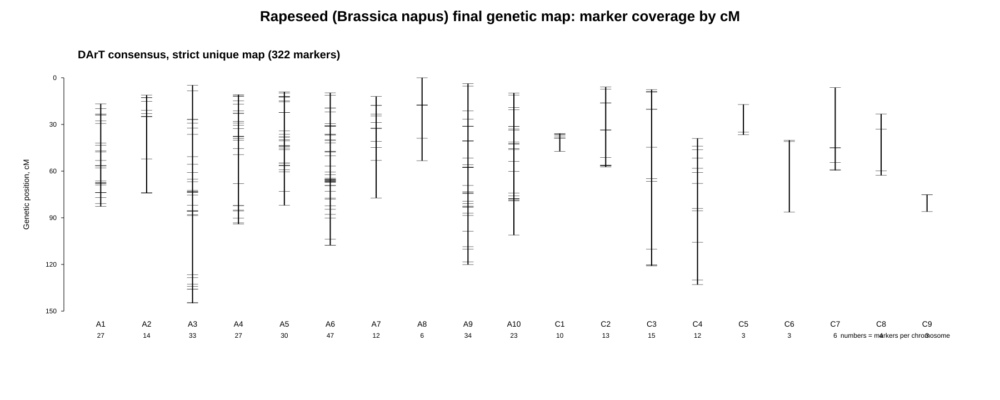
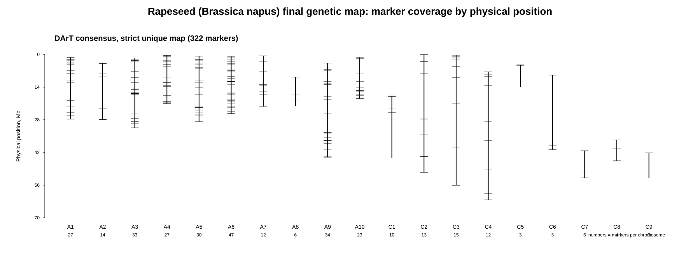
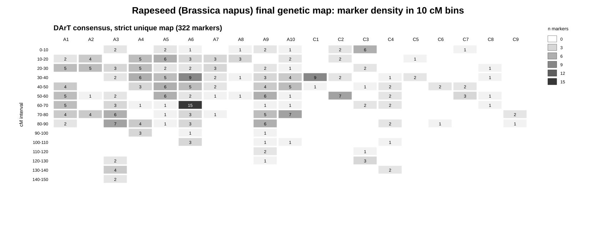

# Рапс (Brassica napus): построение генетической карты

## Цель

Для рапса требовалось получить таблицу генетической карты в формате:

~~~text
chr    pos    cM
~~~

где:

- `chr` — хромосома в актуальной референсной сборке рапса;
- `pos` — физическая позиция маркера на референсном геноме;
- `cM` — генетическая координата маркера в сантиморганах.

Целевой референсный геном:

~~~text
GCF_020379485.1 (Brassica napus cultivar Da-Ae)
~~~

Это сборка хромосомного уровня (NCBI RefSeq reference genome, 2021) с 19 хромосомами
аллотетраплоидного генома: A1–A10 (A-субгеном) и C1–C9 (C-субгеном), что соответствует
n = 19 у *Brassica napus*.

## Исходные данные и общая логика работы

В качестве генетической карты использовалась опубликованная карта рапса,
построенная на DArT-маркерах:

> Raman H. et al. (2014) A consensus map of rapeseed (*Brassica napus* L.) based on
> diversity array technology markers: applications in genetic dissection of qualitative
> and quantitative traits. *BMC Genomics* 14:277.

Из этой работы бралась **Additional file 1**, лист **Consensus Map**: консенсус-карта,
собранная из шести картирующих популяций удвоенных гаплоидов (DH): Ag-Castle/Topas (AT),
BLN2762/Surpass400 (BS), Lynx/Monty (LM), Maxoll/Westar (MW), Skipton/Ag-Spectrum (SAS),
Tapidor/Ningyou7 (TN). Карта содержит имена маркеров, их группу сцепления (A1–A10/C1–C9)
и генетическую позицию в cM.

DArT-маркеры не имеют собственных физических координат на сборке Da-Ae, поэтому позиции
определялись **выравниванием
последовательностей маркеров на референсный геном**:

Генетические координаты `cM` не пересчитывались — они взяты напрямую из опубликованной
консенсус-карты. На референс переносились только физические координаты.

## Источники и загрузка

Скрипт `scripts/01_download_brassica_napus_sources.sh` загружает три источника:

~~~text
1. Референс GCF_020379485.1 (Da-Ae) через NCBI datasets (data/ref/)
2. Консенсус-карта (Additional file 1, xls) из статьи (data/raw/raman2014_dart/)
3. DArT_Brassica.fasta (Diversity Arrays Technology, data/markers/
~~~

Последовательности DArT-маркеров (`DArT_Brassica.fasta`) предоставляются Diversity Arrays
Technology Pty Ltd бесплатно по условиям использования (требуется ссылка на источник, запрет
на перераспространение). Поэтому сырой FASTA и сам референс не хранятся в репозитории, а только воспроизводимо скачиваются скриптом.

## Парсинг консенсус-карты

Скрипт `scripts/02_parse_raman2014_consensus_map.py` разбирает лист **Consensus Map**.

Из листа извлечены 1359 маркеров с группой сцепления и cM:

- DArT-маркеры (имена вида `XbrPb-…`): 791;
- Non-DArT (SSR, SNP, AFLP и др.): 568.

Названия хромосом приводились к стилю целевого референса. В исходной таблице A-хромосомы
записаны с ведущим нулём (`A01…A10`), а C-хромосомы — без него (`C1…C9`); всё нормализовано
к `A1…A10` / `C1…C9`, что совпадает с именами хромосом в сборке Da-Ae.

Для DArT-маркеров формировался join-id (нижний регистр, без ведущего `X`), по которому
подбирались последовательности: `XbrPb-657955` → `brPb-657955`. Уникальных DArT join-id: 783.

## Извлечение последовательностей маркеров

Скрипт `scripts/03_extract_bnapus_dart_marker_sequences.py` вытаскивает из `DArT_Brassica.fasta`
(2866 клонов рода Brassica) последовательности тех DArT-маркеров, что присутствуют на
консенсус-карте.

Последовательность нашлась для **739 из 783** DArT-маркеров (94%). Длина клонов: от 81 до
793 bp, медиана 423 bp — это полноразмерные DArT-фрагменты, пригодные для выравнивания
megablast. 44 маркера не имели клона в FASTA и в карту войти не могли.

## Выравнивание на референс

Скрипт `scripts/04_align_bnapus_dart_markers.sh` строит нуклеотидную BLAST-базу из Da-Ae и
выравнивает клоны:

~~~text
blastn -task megablast -perc_identity 90 -evalue 1e-10 -max_target_seqs 20
~~~

Результат: 2179 HSP, хотя бы один хит получили 673 маркера. Из HSP отбирались только хиты на
19 хромосомах (`NC_063434.1`…`NC_063452.1`); хиты на неразмещённых скэффолдах (`NW_*`)
отбрасывались. Хромосомные хиты есть у 669 маркеров.

## Построение карты и фильтрация

Скрипт `scripts/05_build_bnapus_map_from_alignment.py` строит карту по логике **уникальный хит на ожидаемой хромосоме**:

- для каждого маркера лучший HSP по bitscore задаёт позицию (`pos` = середина интервала на
  референсе);
- маркер считается уникальным, если нет конкурирующего хита в другом локусе с bitscore
  ≥ 0.95 от лучшего — так отсекаются гомеологичные копии между A- и C-субгеномами
  аллотетраплоида;
- в строгую карту берутся маркеры, у которых лучший хит уникален и лежит на хромосоме,
  совпадающей с группой сцепления консенсус-карты;
- после этого удаляются дубли `(chr, pos, cM)` и позиции `(chr, pos)` с конфликтующими
  значениями cM.

Исключения из 783 DArT-маркеров:

~~~text
no_chromosomal_hit                         114   (нет хита на хромосомах ≥90% идентичности)
best_hit_off_expected_chr                  119   (лучший хит на другой хромосоме)
best_hit_off_expected_chr; non_unique       81
non_unique_homoeolog                        61   (равнозначный гомеологичный хит)
~~~

Высокая доля маркеров с лучшим хитом на «не своей» хромосоме ожидаема для DArT в
аллотетраплоидном геноме: часть клонов сильнее выравнивается на гомеологичный субгеном или
на паралог. Строгий фильтр такие случаи убирает.

При удалении конфликтующих позиций из строгого набора отброшено 28 позиций с
неоднозначным cM.

## Итоговая карта

Финальная строгая карта:

~~~text
species/brassica_napus/results/final/brassica_napus_genetic_map.tsv
~~~

Финальный результат: **322 маркера**, все 19 хромосом (A1–A10, C1–C9).

Дополнительные файлы:

~~~text
species/brassica_napus/results/final/brassica_napus_genetic_map.with_markers.tsv   (с marker_id и метриками выравнивания)
species/brassica_napus/results/final/brassica_napus_genetic_map.relaxed_best_hit.tsv  (354 маркера, без требования уникальности)
species/brassica_napus/results/intermediate/bnapus_marker_best_hits.tsv
species/brassica_napus/results/qc/bnapus_map_build_summary.txt
species/brassica_napus/results/qc/bnapus_excluded_markers.tsv
~~~

## Распределение финальных маркеров по хромосомам

A-субгеном покрыт плотнее, чем C-субгеном — это отражает структуру исходной консенсус-карты
Raman et al. 2014 (DArT-маркеров C-генома там заметно меньше):

~~~text
A1   27    A6   47    C1   10    C6    3
A2   14    A7   12    C2   13    C7    6
A3   33    A8    6    C3   15    C8    4
A4   27    A9   34    C4   12    C9    3
A5   30    A10  23    C5    3
~~~

## Проверка коллинеарности финальной карты

Скрипт `scripts/06_qc_bnapus_collinearity.py` считает для каждой хромосомы корреляцию Спирмена
между физической позицией и cM.

Карта хорошо коллинеарна:

- среднее `|Spearman|` по хромосомам: **0.895**;
- медиана `|Spearman|`: **0.966**;
- большинство A-хромосом: `|Spearman|` 0.89–0.99.

Часть хромосом имеет отрицательную корреляцию (A8, A9, C1, C5, C6): это означает лишь обратную
ориентацию группы сцепления относительно сборки Da-Ae — ориентация линкедж-групп условна и не
влияет на качество карты. Наиболее «шумные» хромосомы — слабо покрытые C-хромосомы
(C1: `|Spearman|` 0.41 при 10 маркерах; C6: 0.50 при 3 маркерах), что отражает меньшую плотность
и надёжность C-субгенома в исходной карте.

QC-таблицы:

~~~text
species/brassica_napus/results/qc/brassica_napus_final_map_collinearity_qc.tsv
species/brassica_napus/results/qc/brassica_napus_final_map_summary.txt
species/brassica_napus/results/qc/brassica_napus_final_map_chromosome_summary.tsv
~~~

## Визуализация финальной карты

Скрипт `scripts/07_visualize_bnapus_final_map.py` строит SVG-графики и таблицы плотности.

### Покрытие генетической карты по cM

### Покрытие физической карты по координатам

### Плотность маркеров в 10 cM интервалах

