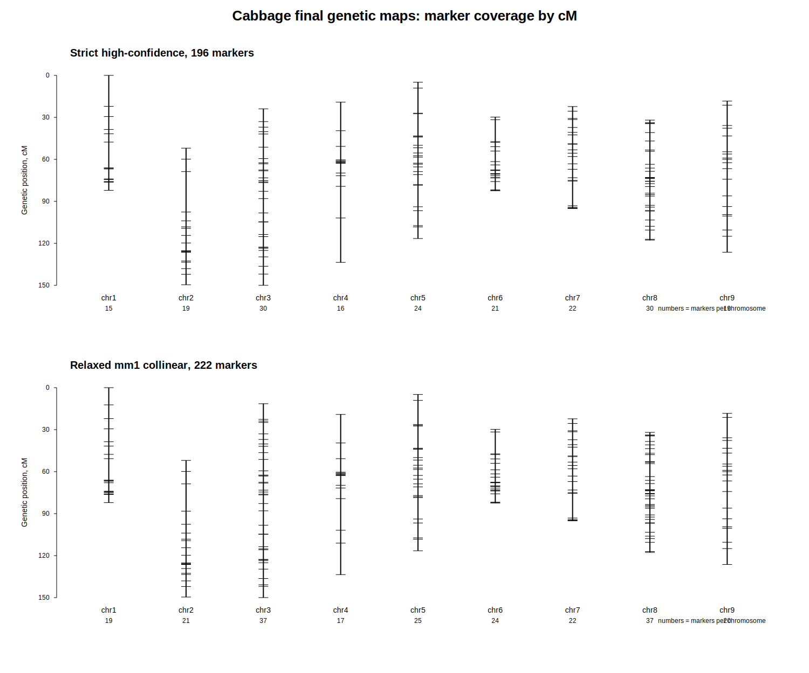
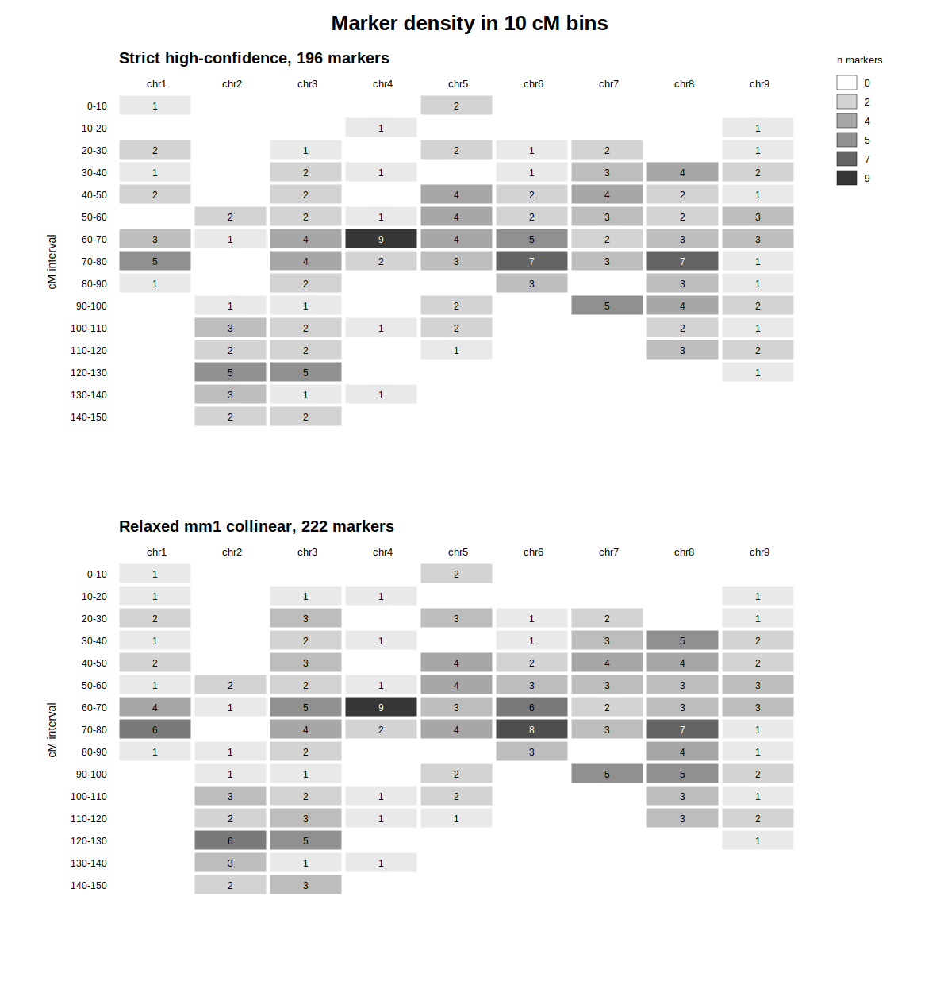
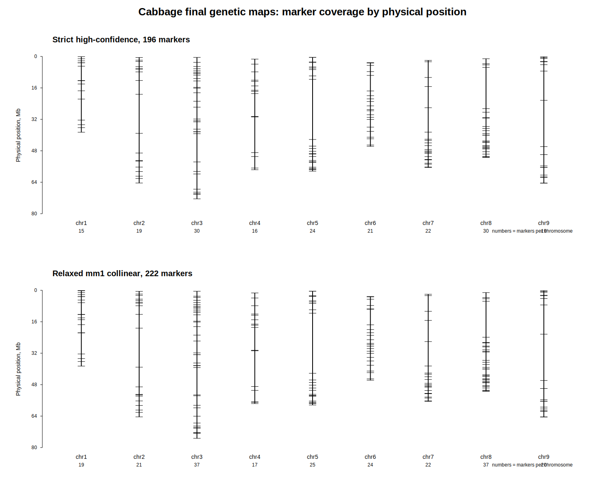

# Отчет: построение генетической карты для капусты белокочанной  
# Brassica oleracea var. capitata

## 1. Цель работы

Целью этой части задания было получить генетическую карту для капусты белокочанной (*Brassica oleracea* var. *capitata*) в формате:

chr    pos    cM

где:

- `chr` — номер хромосомы;
- `pos` — физическая координата маркера на выбранном референсном геноме;
- `cM` — генетическая позиция маркера в сантиморганах.

## 2. Исходные данные

Для капусты использовалась supplementary-таблица из статьи:

Wang et al., BMC Genomics, 2012  
High-density genetic map construction and QTL analysis in *Brassica oleracea*

Исходный файл:

species/brassica_oleracea_capitata/data/raw/cabbage_markers.xls

После просмотра таблицы было установлено, что она содержит 1227 маркеров и следующие основные поля:

- `LG` — linkage group;
- `Position` — порядковая позиция маркера в исходной карте;
- `cM` — генетическая позиция;
- `Marker Name` — название маркера;
- `Marker Type` — тип маркера;
- `Forward Primer` — forward-праймер;
- `Reverse Primer` — reverse-праймер.

Важный момент: в таблице не было готовых полных последовательностей маркеров. Для каждого маркера были указаны forward- и reverse-праймеры. Поэтому физическая координата маркера определялась через выравнивание пары праймеров на референсный геном(физическую координату маркера берем как середину этого ампликона).

## 3. Референсный геном

Для анализа был использован референсный геном:

GCA_018177695.1 / Cabbage_OX-heart_923_BVRC

Референс был скачан через `ncbi-datasets-cli`.

После проверки через `seqkit stats` референс имел следующие характеристики:

- формат: FASTA;
- тип: DNA;
- число последовательностей: 569;
- суммарная длина: 565,471,031 bp;
- максимальная длина последовательности: 76,131,090 bp.

FASTA-файл референсного генома содержит 569 последовательностей. Основная часть маркеров выравнивалась на 9 крупных NCBI/GenBank accession-последовательностей CM031006.1–CM031014.1. Остальные попадания приходились на дополнительные scaffold/contig-последовательности с accession вида JAEMQI....

Чтобы определить, какой accession соответствует какой хромосоме, была построена таблица соответствия между физической последовательностью референса и linkage group исходной генетической карты. Для каждой accession-последовательности была выбрана linkage group, к которой относилось большинство выровненных маркеров.

На основании этого было установлено соответствие:
CM031006.1 → C01 / chr1
CM031007.1 → C02 / chr2
CM031008.1 → C03 / chr3
CM031009.1 → C04 / chr4
CM031010.1 → C05 / chr5
CM031011.1 → C06 / chr6
CM031012.1 → C07 / chr7
CM031013.1 → C08 / chr8
CM031014.1 → C09 / chr9

Маркеры, для которых linkage group не совпадала с основной физической хромосомой, были помечены как конфликтные и исключены из финальных clean-карт.

## 4. Подготовка маркеров

Из исходной таблицы были извлечены:

- marker_id;
- linkage_group;
- cM;
- marker_type;
- forward_primer;
- reverse_primer.

Были созданы два рабочих файла:

species/brassica_oleracea_capitata/data/metadata/cabbage_markers_metadata.tsv  
species/brassica_oleracea_capitata/data/markers/cabbage_primers.fasta

FASTA-файл содержал две записи для каждого маркера:

- `marker_id__F` — forward-праймер;
- `marker_id__R` — reverse-праймер.

Итоговая статистика:

- исходных маркеров: 1227;
- FASTA-записей праймеров: 2454;
- SNP-маркеров: 625;
- SSR-маркеров: 602.

Распределение маркеров по linkage groups:

| LG | Число маркеров |
|---|---:|
| C01 | 132 |
| C02 | 111 |
| C03 | 186 |
| C04 | 136 |
| C05 | 133 |
| C06 | 142 |
| C07 | 142 |
| C08 | 146 |
| C09 | 99 |

Длина праймеров:

- минимум: 17 bp;
- средняя длина: 25.1 bp;
- максимум: 36 bp.

## 5. Выравнивание праймеров

Поскольку праймеры короткие, для выравнивания использовался `blastn` в режиме `blastn-short`.

Сначала была создана BLAST-база по референсному геному. BLAST-база нужна для быстрого поиска коротких последовательностей внутри большого FASTA-файла генома.

После создания базы было выполнено выравнивание всех 2454 праймеров на референсный геном.

Первичный BLAST-результат был большим:

- файл: `cabbage_primers_vs_ref.blast.tsv`;
- размер: около 695 MB;
- число строк: 8,550,043.

Большой размер результата связан с тем, что короткие праймеры дают большое число частичных попаданий в геноме.

## 6. Strict-подход: только полные идеальные совпадения

На первом этапе была построена строгая версия карты. В анализ включались только такие попадания праймеров, где:

- процент идентичности = 100%;
- длина выравнивания равна полной длине праймера;
- gapopen = 0.

После фильтрации было получено:

- 7078 полных идеальных выравниваний;
- 1435 уникальных праймеров с хотя бы одним полным идеальным попаданием.

Далее forward- и reverse-праймеры объединялись в кандидатные ампликоны.

Критерии strict-ампликона:

1. оба праймера имеют полное 100% совпадение с референсом;
2. forward- и reverse-праймер находятся на одной последовательности референса;
3. праймеры расположены во встречной ориентации;
4. длина предполагаемого ампликона не превышает 1000 bp;
5. для маркера найден ровно один кандидатный ампликон.

Результаты сборки strict-ампликонов:

- найдено кандидатных ампликонов: 394;
- маркеров с хотя бы одним кандидатным ампликоном: 371;
- маркеров с ровно одним кандидатным ампликоном: 353.

Все 353 маркера в strict-наборе относились к SSR-маркерам.

## 7. Очистка strict-карты

После получения 353 strict-маркеров была проведена дополнительная фильтрация:

1. удалены маркеры, попавшие на scaffold/contig-последовательности;
2. удалены маркеры с конфликтом между linkage group и физической хромосомой;
3. удалены дублирующиеся физические позиции;
4. accession-идентификаторы были заменены на номера хромосом 1–9.

Результаты:

- входной strict-набор: 353 маркера;
- маркеры на chromosome-level CM accession: 336;
- исключено scaffold/contig-попаданий: 17;
- исключено LG/ref_seq конфликтов: 21;
- осталось после chromosome/LG-фильтрации: 315;
- строк с дублирующимися физическими позициями: 19;
- unique strict-карта: 296 маркеров.

Файл промежуточной strict-карты:

species/brassica_oleracea_capitata/results/intermediate/cabbage_genetic_map.strict_296.tsv

## 8. Проверка коллинеарности strict-карты

Для каждой хромосомы была проверена согласованность между физической координатой `pos` и генетической координатой `cM`.

Для этого рассчитывалась корреляция Спирмена между `pos` и `cM`.

Интерпретация:

- положительная корреляция означает, что cM в целом увеличивается с ростом физической координаты;
- отрицательная корреляция означает, что linkage group ориентирована противоположно физической хромосоме;
- слабая корреляция указывает на возможные outlier-маркеры или проблемы переноса.

Для получения максимально аккуратной high-confidence версии была оставлена максимальная монотонная последовательность маркеров на каждой хромосоме.

Результат collinearity-фильтрации strict-карты:

| chr | Ориентация | До фильтра | Оставлено | Outliers |
|---:|---|---:|---:|---:|
| 1 | increasing | 28 | 15 | 13 |
| 2 | increasing | 23 | 19 | 4 |
| 3 | decreasing | 41 | 30 | 11 |
| 4 | increasing | 34 | 16 | 18 |
| 5 | increasing | 32 | 24 | 8 |
| 6 | decreasing | 30 | 21 | 9 |
| 7 | decreasing | 37 | 22 | 15 |
| 8 | increasing | 46 | 30 | 16 |
| 9 | decreasing | 25 | 19 | 6 |

Итоговая high-confidence strict-карта содержит 196 маркеров.

Финальный файл:

species/brassica_oleracea_capitata/results/final/cabbage_genetic_map.high_confidence_196.tsv

## 9. Relaxed-подход: разрешение одного mismatch на праймер

Так как strict-подход оказался очень строгим и существенно уменьшил плотность карты, была протестирована более мягкая стратегия.

В relaxed-подходе для каждого праймера разрешалось не более одного mismatch:

- длина выравнивания равна полной длине праймера;
- mismatch <= 1;
- gapopen = 0.

После relaxed-фильтрации было получено:

- full-length hits с mismatch <= 1: 11651;
- уникальных праймеров с такими попаданиями: 1582.

Для сравнения, strict-подход давал:

- full-length perfect hits: 7078;
- уникальных праймеров с perfect hit: 1435.

## 10. Сборка relaxed-ампликонов

Для relaxed primer-mm1 стратегии использовались следующие критерии:

1. каждый праймер выравнивается по всей длине;
2. каждый праймер имеет не более одного mismatch;
3. gapopen = 0;
4. forward- и reverse-праймеры находятся на одной последовательности референса;
5. праймеры расположены во встречной ориентации;
6. длина предполагаемого ампликона не превышает 1000 bp;
7. для маркера найден ровно один кандидатный ампликон.

Результаты:

- full-length <=1 mismatch primer hits: 11651;
- unique primers with full-length <=1 mismatch hits: 1582;
- unique markers with at least one relaxed primer hit: 1115;
- candidate amplicons found: 485;
- markers with at least one candidate amplicon: 441;
- markers with exactly one candidate amplicon: 415.

Среди 415 однозначных ампликонов:

| total_mismatch | Число ампликонов |
|---:|---:|
| 0 | 347 |
| 1 | 61 |
| 2 | 7 |

По типу маркеров:

| Тип | Число |
|---|---:|
| SSR | 414 |
| SNP | 1 |

Даже после смягчения фильтрации почти все восстановленные маркеры относились к SSR.

## 11. Очистка relaxed-карты

Для relaxed-карты была выполнена такая же очистка, как для strict-карты:

1. удаление scaffold/contig-попаданий;
2. удаление LG/ref_seq конфликтов;
3. удаление дублирующихся физических позиций;
4. переименование chromosome-level accession в номера хромосом.

Результаты:

- входных relaxed-маркеров: 415;
- маркеров на chromosome-level CM accession: 393;
- исключено scaffold/contig-попаданий: 22;
- исключено LG/ref_seq конфликтов: 32;
- осталось после chromosome/LG-фильтрации: 361;
- строк с дублирующимися физическими позициями: 24;
- relaxed clean unique карта: 337 маркеров.

Распределение relaxed clean unique маркеров по хромосомам:

| chr | Маркеров |
|---:|---:|
| 1 | 33 |
| 2 | 25 |
| 3 | 52 |
| 4 | 39 |
| 5 | 36 |
| 6 | 32 |
| 7 | 39 |
| 8 | 55 |
| 9 | 26 |

По числу mismatch в паре праймеров:

| total_mismatch | Число маркеров |
|---:|---:|
| 0 | 293 |
| 1 | 41 |
| 2 | 3 |

Промежуточный файл:

species/brassica_oleracea_capitata/results/intermediate/cabbage_genetic_map.relaxed_primer_mm1.clean.unique.tsv

## 12. Коллинеарность relaxed-карты

Для relaxed clean unique карты также была проведена проверка коллинеарности.

Корреляция Спирмена между `pos` и `cM`:

| chr | n_markers | Spearman |
|---:|---:|---:|
| 1 | 33 | 0.559 |
| 2 | 25 | 0.982 |
| 3 | 52 | -0.960 |
| 4 | 39 | 0.378 |
| 5 | 36 | 0.989 |
| 6 | 32 | -0.965 |
| 7 | 39 | -0.925 |
| 8 | 55 | 0.947 |
| 9 | 26 | -0.996 |

Хромосомы 2, 5 и 8 показали сильную положительную корреляцию.  
Хромосомы 3, 6, 7 и 9 показали сильную отрицательную корреляцию, что соответствует обратной ориентации linkage group относительно физической хромосомы.  
Хромосомы 1 и 4 имели более слабую корреляцию, что наблюдалось и в strict-версии.

После дополнительной фильтрации по коллинеарности было получено:

| chr | Ориентация | До фильтра | Оставлено | Outliers |
|---:|---|---:|---:|---:|
| 1 | increasing | 33 | 19 | 14 |
| 2 | increasing | 25 | 21 | 4 |
| 3 | decreasing | 52 | 37 | 15 |
| 4 | increasing | 39 | 17 | 22 |
| 5 | increasing | 36 | 25 | 11 |
| 6 | decreasing | 32 | 24 | 8 |
| 7 | decreasing | 39 | 22 | 17 |
| 8 | increasing | 55 | 37 | 18 |
| 9 | decreasing | 26 | 20 | 6 |

Итого:

- маркеров до collinearity-фильтра: 337;
- оставлено маркеров: 222;
- outliers: 115.

Среди сохраненных маркеров:

| total_mismatch | Число |
|---:|---:|
| 0 | 192 |
| 1 | 30 |

Маркеры с `total_mismatch = 2` после collinearity-фильтрации не вошли в финальную relaxed-collinear карту.

Финальный файл relaxed-версии:

species/brassica_oleracea_capitata/results/final/cabbage_genetic_map.relaxed_mm1_collinear_222.tsv

## 13. Итоговые результаты

Для капусты были получены две финальные версии карты.

### 13.1. High-confidence strict map

Файл:

species/brassica_oleracea_capitata/results/final/cabbage_genetic_map.high_confidence_196.tsv

Критерии:

- оба праймера имеют 100% full-length совпадение;
- найден ровно один кандидатный ампликон;
- ампликон расположен на chromosome-level последовательности;
- linkage group согласована с физической хромосомой;
- физическая позиция уникальна;
- маркер проходит фильтр коллинеарности.

Число маркеров: 196.

### 13.2. Relaxed mm1 collinear map

Файл:

species/brassica_oleracea_capitata/results/final/cabbage_genetic_map.relaxed_mm1_collinear_222.tsv

Критерии:

- каждый праймер имеет full-length совпадение с максимум одним mismatch;
- найден ровно один кандидатный ампликон;
- ампликон расположен на chromosome-level последовательности;
- linkage group согласована с физической хромосомой;
- физическая позиция уникальна;
- маркер проходит фильтр коллинеарности.

Число маркеров: 222.

Эта версия менее строгая, но более плотная. Она содержит на 26 маркеров больше, чем high-confidence strict map.

## 14. Почему финальные карты менее плотные, чем исходная публикационная карта

Исходная таблица содержала 1227 маркеров. В финальные карты вошло значительно меньше маркеров, потому что для переноса на новый референсный геном применялись строгие критерии качества.

Основные причины потери маркеров:

1. не все праймеры имеют полное совпадение с выбранным референсом;
2. референсный геном отличается от генетического материала исходной статьи;
3. часть праймеров имеет множественные попадания;
4. часть пар праймеров не образует однозначный ампликон;
5. часть маркеров попадает на scaffolds/contigs;
6. часть маркеров конфликтует с ожидаемой chromosome/linkage group;
7. часть маркеров нарушает коллинеарный порядок физической и генетической карты.

Таким образом, финальные карты являются не полной копией исходной карты, а conservative/high-confidence переносом маркеров на выбранный референсный геном.

## 15. Ограничения анализа

1. В исходной таблице были доступны только праймеры, а не полные последовательности маркеров.
2. Для физического размещения маркера использовалась середина предполагаемого ампликона.
3. Использованный референсный геном может отличаться от линий, использованных в исходной статье.
4. SNP-маркеры почти не восстановились при выбранной стратегии.
5. Более мягкая relaxed-версия увеличивает плотность карты, но потенциально менее строгая, чем high-confidence strict map.
6. Фильтрация по коллинеарности удаляет маркеры, нарушающие общий порядок, но часть таких маркеров теоретически может отражать реальные особенности исходной карты, локальные перестройки или проблемы сборки.

## 16. Использованные скрипты

Скрипты анализа сохранены в папке:

species/brassica_oleracea_capitata/scripts/

Основные шаги:

| Скрипт | Назначение |
|---|---|
| 01_extract_cabbage_primers.py | извлечение праймеров и метаданных из XLS |
| 02_build_cabbage_amplicons_from_perfect_hits.py | сборка strict-ампликонов |
| 03_qc_cabbage_strict_map.py | QC соответствия ref_seq и linkage groups |
| 04_filter_cabbage_strict_map.py | очистка strict-карты |
| 05_qc_cabbage_final_strict_map.py | проверка коллинеарности strict clean unique карты |
| 06_filter_cabbage_collinear_markers.py | collinearity-фильтр strict-карты |
| 07_build_cabbage_amplicons_relaxed_primer_mm1.py | сборка relaxed primer-mm1 ампликонов |
| 08_filter_cabbage_relaxed_primer_mm1_map.py | очистка relaxed-карты |
| 09_qc_cabbage_relaxed_primer_mm1_map.py | QC relaxed clean unique карты |
| 10_filter_cabbage_relaxed_primer_mm1_collinear_markers.py | collinearity-фильтр relaxed-карты |

## 17. Вывод

Для *Brassica oleracea* var. *capitata* были построены две версии генетической карты в формате `chr pos cM`.

Основная строгая версия:

species/brassica_oleracea_capitata/results/final/cabbage_genetic_map.high_confidence_196.tsv

Более мягкая версия:

species/brassica_oleracea_capitata/results/final/cabbage_genetic_map.relaxed_mm1_collinear_222.tsv

High-confidence strict map максимально надежна, но менее плотная.  
Relaxed mm1 collinear map более плотная и сохраняет контролируемое качество, поскольку все маркеры имеют однозначный ампликон, согласованы с chromosome/linkage group и проходят фильтр коллинеарности.

Обе версии сохранены как финальные результаты для капусты.

## Дополнительный анализ исходных праймеров

После построения strict и relaxed mm1 версий карты был выполнен дополнительный анализ исходных праймеров. Цель этого анализа состояла не в построении ещё более расслабленной карты, а в том, чтобы понять, почему значительная часть маркеров не переносится на выбранный референсный геном и имеет ли смысл дополнительно увеличивать допустимое число mismatch.

Для каждого праймера был определён лучший full-length no-gap hit на референсном геноме. Под full-length no-gap hit понималось такое BLAST-попадание, где длина выравнивания равна полной длине праймера и отсутствуют gap openings. Далее для каждого праймера было посчитано минимальное число mismatch среди таких попаданий.

Распределение праймеров по минимальному числу mismatch:

| Минимальное число mismatch | Число праймеров | Доля от всех праймеров |
|---:|---:|---:|
| 0 | 1435 | 58.48% |
| 1 | 147 | 5.99% |
| 2 | 50 | 2.04% |
| 3 | 10 | 0.41% |
| 4 | 1 | 0.04% |
| 5 | 0 | 0.00% |
| >5 | 0 | 0.00% |
| нет full-length no-gap hit | 811 | 33.05% |

Этот результат показывает, что основная проблема не в большом количестве праймеров с 2–3 mismatch. Основная потеря происходит из-за того, что 811 праймеров вообще не имеют полного выравнивания без гэпов на выбранный референсный геном. Такие праймеры нельзя надёжно спасти простым разрешением большего числа mismatch, потому что причина может быть связана не только с точечными заменами, но и с indel, структурными различиями, отсутствием соответствующего участка в референсе, частичным совпадением или попаданием в повторяющиеся области.

Дополнительно был оценён rescue potential на уровне маркеров, то есть сколько маркеров имеют оба праймера с full-length no-gap hit при разных порогах mismatch.

| Порог mismatch на каждый праймер | Маркеров с двумя пригодными праймерами | Новых маркеров относительно предыдущего порога | Маркеров с multihit среди лучших попаданий |
|---:|---:|---:|---:|
| 0 | 383 | 383 | 94 |
| 1 | 467 | 84 | 128 |
| 2 | 496 | 29 | 143 |
| 3 | 504 | 8 | 146 |
| 4 | 505 | 1 | 146 |
| 5 | 505 | 0 | 146 |

Переход от strict-подхода к relaxed mm1 оказался полезным: при разрешении одного mismatch на каждый праймер число потенциально пригодных маркеров увеличилось с 383 до 467. Однако дальнейшее расслабление фильтра даёт небольшой прирост. Порог mm2 добавляет только 29 новых потенциальных маркеров, mm3 — ещё 8, а mm4 — только один маркер.

По типам маркеров наблюдается следующая картина:

| Порог mismatch на каждый праймер | SSR | SNP |
|---:|---:|---:|
| 0 | 381 | 2 |
| 1 | 461 | 6 |
| 2 | 486 | 10 |
| 3 | 489 | 15 |
| 4 | 489 | 16 |
| 5 | 489 | 16 |

Relaxed mm2/mm3 немного увеличивает число потенциально пригодных SNP-маркеров, но даже при пороге mm3 их остаётся мало. Это указывает на то, что слабое восстановление SNP-маркеров не решается простым увеличением допустимого числа mismatch. Вероятно, часть SNP/SNAP-маркеров хуже переносится на другой референс или является более чувствительной к различиям между генотипами.

На основании этого анализа было принято решение не строить дополнительную mm2/mm3 карту. Такой вариант мог бы добавить небольшое число маркеров, но одновременно увеличил бы риск включения менее надёжных попаданий, особенно для праймеров с несколькими full-length hit или с mismatch в потенциально критичных позициях. Для финального результата были оставлены две контролируемые версии карты: strict high-confidence и relaxed mm1 collinear.

Файлы дополнительного QC праймеров:

- `results/qc/cabbage_primer_mismatch_spectrum.tsv`
- `results/qc/cabbage_primer_min_mismatch_distribution.tsv`
- `results/qc/cabbage_marker_min_mismatch_spectrum.tsv`
- `results/qc/cabbage_marker_rescue_potential_by_threshold.tsv`
- `results/qc/cabbage_marker_rescue_potential_by_threshold_and_type.tsv`
- `results/qc/cabbage_marker_rescue_candidates_mm2_mm3.tsv`

Вывод: relaxed mm1 является разумным компромиссом между плотностью и надёжностью. Дальнейшее увеличение допустимого числа mismatch не даёт существенного прироста маркеров и поэтому не использовалось для построения финальной карты.

## Визуализация покрытия финальных карт маркерами

Для оценки качества полученных карт была выполнена визуализация распределения финальных маркеров по хромосомам. Такой анализ нужен, чтобы проверить не только итоговое число маркеров, но и то, насколько равномерно они покрывают linkage groups и физические хромосомы.

В исходной статье карта капусты была представлена как набор linkage groups C01–C09 с расположением маркеров вдоль генетической координаты. В данной работе аналогичная визуализация была построена для двух финальных версий карты: strict high-confidence и relaxed mm1 collinear.

### Покрытие генетической карты по cM

**Figure 1. Покрытие финальных генетических карт капусты маркерами.**  
На рисунке показано распределение маркеров вдоль генетической координаты cM для двух финальных версий карты: strict high-confidence map из 196 маркеров и relaxed mm1 collinear map из 222 маркеров. Каждая вертикальная линия соответствует хромосоме/linkage group, короткие горизонтальные штрихи показывают позиции маркеров. Числа под хромосомами показывают количество маркеров на каждой хромосоме.

Relaxed mm1 collinear карта содержит больше маркеров, чем strict high-confidence карта, при этом покрывает все 9 хромосом. Наиболее заметное увеличение числа маркеров наблюдается на chr1, chr3, chr6 и chr8. Однако распределение маркеров остаётся неравномерным: на некоторых хромосомах сохраняются участки с низкой плотностью маркеров.

### Плотность маркеров в 10 cM окнах

**Figure 2. Плотность маркеров в 10 cM интервалах.**  
Для каждой финальной карты была рассчитана плотность маркеров в окнах по 10 cM. Более тёмные ячейки соответствуют большему числу маркеров в данном интервале. Эта визуализация показывает, что маркеры распределены по linkage groups неравномерно: присутствуют как участки с кластеризацией маркеров, так и интервалы с низкой плотностью или отсутствием маркеров.

Такой результат ожидаем для карты, полученной переносом маркеров из исходной публикации на другой современный референсный геном с применением строгих QC-фильтров. Часть исходных маркеров была исключена из-за отсутствия полного совпадения праймеров, множественных попаданий, scaffold/contig-попаданий, конфликтов между linkage group и физической хромосомой или нарушения коллинеарного порядка.

### Покрытие физической карты по координате pos

**Figure S1. Покрытие физической карты капусты финальными маркерами.**  
На рисунке показано распределение тех же финальных маркеров по физическим координатам референсного генома. Эта визуализация используется как дополнительный QC переноса карты на референс. Она позволяет оценить, насколько равномерно маркеры покрывают физические хромосомы и где остаются крупные интервалы без маркеров.

