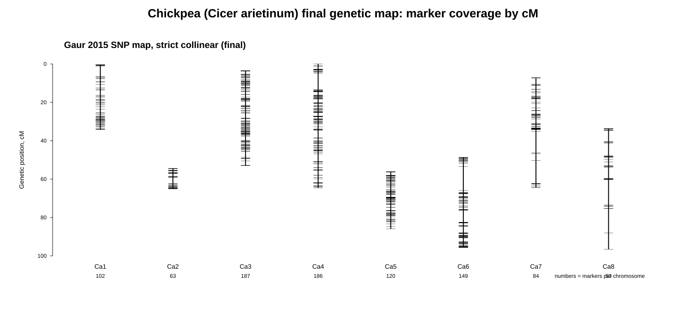

# Нут: построение генетической карты

## Цель

Для нута требовалось получить таблицу генетической карты в формате:

~~~text
chr    pos    cM
~~~

где:

- `chr` — хромосома в актуальной референсной сборке;
- `pos` — физическая позиция маркера;
- `cM` — генетическая координата маркера в сантиморганах.

Целевой референсный геном:

~~~text
GCF_000331145.1_ASM33114v1
~~~

Это сборка kabuli-нута сорта CDC Frontier (Varshney et al. 2013) с 8 псевдохромосомами
`Ca1`–`Ca8` (`NC_021160.1`–`NC_021167.1`).

## Источник данных

Использована высокоплотная SNP-карта:

> Gaur R. et al. (2015) High density linkage mapping of genomic and transcriptomic
> SNPs for synteny analysis and anchoring the genome sequence of chickpea.
> *Scientific Reports* 5:13387.

Карта построена на межвидовой популяции ICC 4958 (*C. arietinum*) × PI 489777
(*C. reticulatum*). Из Supplementary Information (`srep13387-s1.pdf`) использованы:

- **Table S1** — фланкирующие последовательности 6144 SNP в форме `…[A/G]…`;
- **Table S2** — генетические позиции (группа сцепления `CaLG1`–`CaLG8` и `cM`)
  6698 маркеров карты.

По имени маркера таблицы объединены: для SNP-маркеров (`CaSNP*` — геномные,
`CaTSNP*` — транскриптомные) получены группа сцепления, `cM` и последовательность
для выравнивания. Совпало **4936** маркеров с одновременно `cM` и фланком.

## Почему не SSR-карта Khajuria et al. 2015

Первым рассматривался SSR-источник (Khajuria et al. 2015, PLoS ONE e0125583,
634 картируемых SSR с праймерами). Однако выравнивание пар праймеров на CDC Frontier
показало, что маркеры **не переносятся** на эту сборку: даже при строго уникальной
паре праймеров лишь ~24–26 % маркеров попадали на хромосому своей группы сцепления,
и согласованная подвыборка была неколлинеарной (`|Spearman|` ≈ 0.05–0.6). Причина —
короткие SSR-праймеры и in-silico происхождение маркеров в межвидовом кресте
desi × дикий: уникальный хит в kabuli-сборке чаще приходится на паралог/другой локус.
Поэтому источник заменён на SNP-карту Gaur et al. 2015 с длинными специфичными
фланками.

## Метод

Физические координаты SNP на актуальной сборке получены выравниванием их
фланкирующих последовательностей на референс. `cM` взяты напрямую из карты Gaur
et al. 2015 и **не пересчитывались**.

Шаги (скрипты в `scripts/`):

~~~text
01_download_cicer_sources.sh      загрузка референса (NCBI datasets) и supplementary
02_parse_gaur2015_map.py          парсинг Table S1+S2 -> метаданные + FASTA-зонды
03_align_cicer_snp_probes.sh      makeblastdb + blastn (megablast) зондов на референс
04_build_cicer_map.py             сборка карты-кандидата
05_strict_collinear_cicer.py      приведение к строгой коллинеарности
06_qc_cicer_collinearity.py       QC коллинеарности
07_visualize_cicer_final_map.py   графики покрытия и плотности
~~~

Каждый зонд формировался из фланка заменой `[A/G]` на первый аллель. Зонды (~120 bp)
выравнивались megablast'ом на всю сборку. Для каждого маркера брался лучший хит по
bitscore при условиях:

- покрытие ≥ 80 % длины зонда;
- уникальность: bitscore второго хита < 0.95 от лучшего;
- хит на псевдохромосоме `Ca1`–`Ca8`, номер которой совпадает с группой сцепления.

Позиция маркера `pos` — середина хита. Соответствие `CaLG k` ↔ `Ca k` подтверждено
эмпирически: среди уникально размещённых маркеров **97 %** попали на хромосому своей
группы сцепления (в отличие от 24 % у SSR).

## Строгая коллинеарность

Для каждой хромосомы карта приводилась к строго коллинеарной:

- ориентация выбиралась по максимуму сохранённых маркеров; хромосомы с обратной
  ориентацией разворачивались отражением оси `cM' = cM_max − cM` (`cM` не
  пересчитываются, сохраняются лишь расстояния);
- дублирующиеся физические позиции схлопывались (медианный `cM`);
- оставлялась самая длинная неубывающая по `cM` подпоследовательность при сортировке
  по `pos` (минимум удаляемых маркеров).

Развёрнуты хромосомы `Ca1, Ca3, Ca4, Ca7`. Доля сохранённых маркеров по хромосомам
отражает качество сборки ASM33114v1: часть псевдохромосом (`Ca1`, `Ca2`) заметно
рассогласована с генетической картой (`|Spearman|` кандидата 0.05–0.42), что согласуется
с известными проблемами сборки v1, которые Gaur et al. 2015 как раз выявляли по карте;
хорошо согласованные `Ca3`/`Ca4` сохраняют больше маркеров.

## Итоговые результаты

- карта-кандидат (все уникально размещённые SNP): **3702** маркера;
- **финальная строгая коллинеарная карта: 941** маркер (все 8 хромосом,
  `monotonic_fraction = 1.0`, медиана `|Spearman|` = 1.000).

Распределение маркеров строгой карты по хромосомам:

~~~text
Ca1 102   Ca2  63   Ca3 187   Ca4 186
Ca5 120   Ca6 149   Ca7  84   Ca8  50
~~~

Финальная карта:

~~~text
species/cicer_arietinum/results/final/cicer_arietinum_genetic_map.tsv
~~~

Дополнительные файлы:

~~~text
species/cicer_arietinum/results/final/cicer_arietinum_genetic_map.candidate.tsv
species/cicer_arietinum/results/final/cicer_arietinum_genetic_map.with_markers.tsv
species/cicer_arietinum/results/qc/cicer_final_map_collinearity_qc.tsv
species/cicer_arietinum/results/qc/cicer_candidate_map_collinearity_qc.tsv
species/cicer_arietinum/results/qc/cicer_final_map_summary.txt
~~~

## Визуализация

График покрытия генетической карты:

График покрытия физической карты и плотность маркеров в интервалах по 10 cM
сохранены в `results/figures/cicer_physical_map_coverage.svg` и
`results/figures/cicer_marker_density_10cM.svg`.
