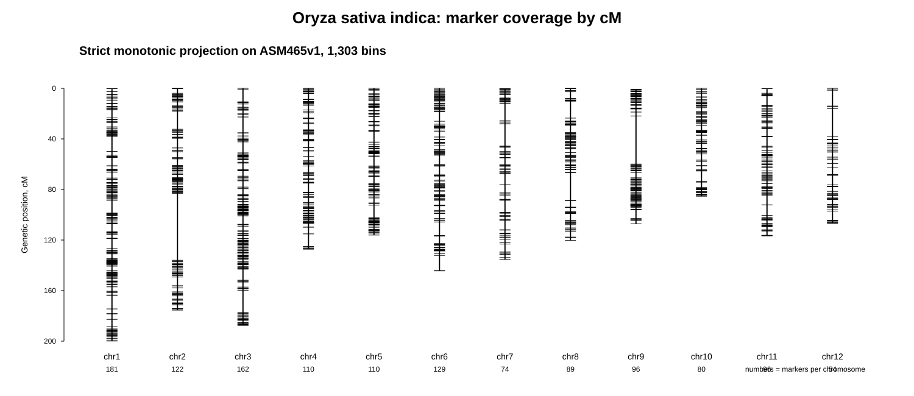
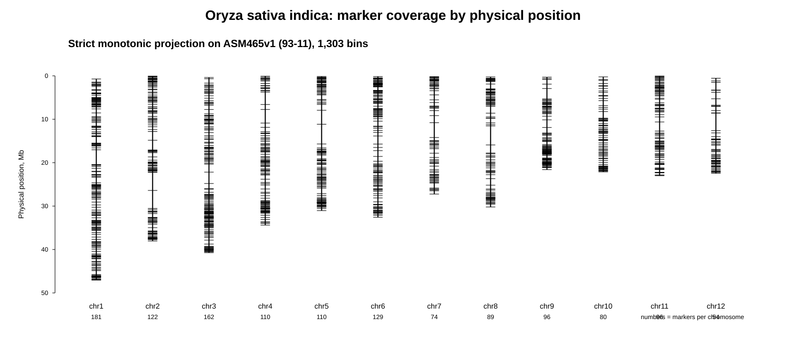
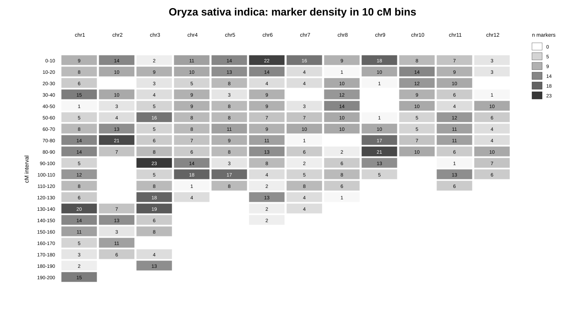

# Oryza sativa indica: построение генетической карты

## Цель

Для *Oryza sativa indica* требовалось получить таблицу генетической карты в формате:

~~~text
chr    pos    cM
~~~

где:

- `chr` — номер хромосомы в целевом референсном геноме;
- `pos` — физическая позиция на целевом референсе;
- `cM` — генетическая координата в сантиморганах.

Целевой референсный геном:

~~~text
GCA_000004655.2_ASM465v1
~~~

Файл референса на сервере:

~~~text
/mnt/reference/genomes/oryza_sativa_indica/GCA_000004655.2/Oryza_indica.ASM465v1.dna.toplevel.fa
~~~

Аннотация:

~~~text
/mnt/reference/genomes/oryza_sativa_indica/GCA_000004655.2/Oryza_indica.ASM465v1.59.gff3
~~~

Основные хромосомы в FASTA называются:

~~~text
1
2
3
4
5
6
7
8
9
10
11
12
~~~

Помимо них в FASTA присутствуют дополнительные unplaced/scaffold sequences, например `CH398230.1`, `AAAA02035458.1` и другие. Для финальной genetic map использовались только основные хромосомы `1–12`.

## Источник генетической карты

В качестве источника генетических позиций использовалась опубликованная высокоплотная SNP/bin map из статьи:

~~~text
Yu H., Xie W., Wang J., Xing Y., Xu C., Li X., Xiao J., Zhang Q.
Gains in QTL Detection Using an Ultra-High Density SNP Map Based on Population Sequencing Relative to Traditional RFLP/SSR Markers.
PLOS ONE, 2011.
DOI: 10.1371/journal.pone.0017595
URL: https://journals.plos.org/plosone/article?id=10.1371/journal.pone.0017595
~~~

Использован файл из сапплементари:

~~~text
pone.0017595.s004.xls
~~~

Этот файл был загружен и сохранен в japonica-папке, так как он уже использовался для построения japonica-карты:

~~~text
species/oryza_sativa_japonica/data/raw/public_sources/published_maps/yu_2011_plosone/pone.0017595.s004.xls
~~~

В таблице содержалась bin map для 1,619 recombinant bins. Для каждого bin были доступны:

~~~text
bin
chromosme
start
stop
bin_size_mb
genetic_map_cm
~~~

Физические координаты в данной статье заданы не на ASM465v1, а на старом japonica/Nipponbare референсе:

~~~text
TIGR6.1 / MSU / Nipponbare
~~~

При этом целевой референс для этой части работы:

~~~text
ASM465v1 / 93-11 / indica
~~~

Генетические координаты `cM` не пересчитывались. Они были взяты из опубликованной genetic map. Переносились только физические координаты.

## Почему была нужна строгая фильтрация

Для japonica перенос выполнялся между близкими референсами Nipponbare/TIGR6.1 и Nipponbare/IRGSP-1.0. Для indica перенос выполнялся между разными подвидами:

~~~text
source physical coordinates: TIGR6.1 / Nipponbare / japonica
target physical coordinates: ASM465v1 / 93-11 / indica
~~~

Поэтому часть точек могла:

- не перенестись;
- перенестись на non-primary scaffold;
- перенестись на другую хромосому;
- локально нарушить порядок `pos` относительно `cM`.

Из-за этого финальный файл был получен через строгую фильтрацию.

## Скрипты

Основные скрипты:

~~~text
species/oryza_sativa_indica/scripts/01_liftover_yu2011_tigr6_to_asm465v1.sh
species/oryza_sativa_indica/scripts/02_build_yu2011_asm465v1_candidate_map.py
species/oryza_sativa_indica/scripts/03_qc_yu2011_asm465v1_projection_collinearity.py
species/oryza_sativa_indica/scripts/04_make_yu2011_asm465v1_strict_same_chr_map.py
species/oryza_sativa_indica/scripts/05_make_yu2011_asm465v1_strict_monotonic_map.py
~~~

## Перенос координат TIGR6.1 на ASM465v1

Для переноса физических координат был использован полное выравнивание генома TIGR6.1 на целевой indica референс ASM465v1.

Команда внутри скрипта:

~~~bash
/mnt/users/tagirovaa/bin/minimap2 \
  -t 6 \
  -cx asm5 \
  /mnt/reference/genomes/oryza_sativa_indica/GCA_000004655.2/Oryza_indica.ASM465v1.dna.toplevel.fa \
  species/oryza_sativa_japonica/data/raw/references/tigr6/tigr6_pseudomolecules.fa \
  > species/oryza_sativa_indica/results/liftover/yu2011_tigr6_to_asm465v1/tigr6_to_asm465v1.asm5.paf
~~~

Затем BED-точки были перенесены через `paftools.js liftover`:

~~~bash
/mnt/users/grigorieval/miniconda3/bin/k8 \
  /mnt/users/grigorieval/miniconda3/bin/paftools.js \
  liftover \
  -l 1 \
  species/oryza_sativa_indica/results/liftover/yu2011_tigr6_to_asm465v1/tigr6_to_asm465v1.asm5.paf \
  species/oryza_sativa_japonica/data/raw/public_sources/published_maps/yu_2011_plosone/yu2011_bins_tigr6_midpoints.fasta_seqids.bed \
  > species/oryza_sativa_indica/results/liftover/yu2011_tigr6_to_asm465v1/yu2011_bins_asm465v1_lifted.bed
~~~

Ключевые выходные файлы liftover:

~~~text
species/oryza_sativa_indica/results/liftover/yu2011_tigr6_to_asm465v1/yu2011_bins_asm465v1_lifted.bed
species/oryza_sativa_indica/results/liftover/yu2011_tigr6_to_asm465v1/minimap2_tigr6_to_asm465v1.log
species/oryza_sativa_indica/results/liftover/yu2011_tigr6_to_asm465v1/paftools_liftover.log
species/oryza_sativa_indica/results/liftover/yu2011_tigr6_to_asm465v1/01_liftover_yu2011_tigr6_to_asm465v1.nohup.log
~~~

## Первичная карта

После переноса была построена первиная карта:

~~~text
species/oryza_sativa_indica/results/final/oryza_sativa_indica_genetic_map.candidate_yu2011_projection.tsv
species/oryza_sativa_indica/results/final/oryza_sativa_indica_genetic_map.candidate_yu2011_projection.details.tsv
~~~

Первичный QC:

~~~text
species/oryza_sativa_indica/results/qc/yu2011_asm465v1_projection_summary.txt
species/oryza_sativa_indica/results/qc/yu2011_asm465v1_projection_by_chr.tsv
species/oryza_sativa_indica/results/qc/yu2011_asm465v1_nonprimary_lifted_rows.tsv
species/oryza_sativa_indica/results/qc/yu2011_asm465v1_unlifted_bins.tsv
~~~

Ключевые результаты первичного переноса:

~~~text
original_bed_rows               1619
raw_lifted_bed_rows             1337
lifted_rows_primary_1_12        1331
nonprimary_lifted_rows          6
unlifted_rows                   283
candidate_map_rows              1331
same_chr_as_source              1312
duplicate_chr_pos               0
~~~

## Фильтрация same-chr

На следующем этапе были оставлены только bins, перенесенные на ту же хромосому, что и в исходной Yu2011 map:

~~~text
same_chr_input_rows = 1312
~~~

Промежуточный same-chr файл:

~~~text
species/oryza_sativa_indica/results/final/oryza_sativa_indica_genetic_map.strict_yu2011_projection.tsv
species/oryza_sativa_indica/results/final/oryza_sativa_indica_genetic_map.strict_yu2011_projection.details.tsv
~~~

После этого была проверена монотонность `cM` при сортировке по физической позиции `pos`. В same-chr-only наборе остались локальные нарушения порядка:

~~~text
chr3   decreasing_cM_steps = 2
chr4   decreasing_cM_steps = 4
chr11  decreasing_cM_steps = 3
~~~

Эти 9 проблемных точек были удалены на следующем этапе.

## Финальная strict monotonic map

Для получения финальной карты был применен фильтр монотонности позиций. Внутри каждой хромосомы точки были отсортированы по `pos`, после чего оставлялась максимальная монотонно возрастающая цепочка по `cM`.

Финальная карта:

~~~text
species/oryza_sativa_indica/results/final/oryza_sativa_indica_genetic_map.strict_monotonic_yu2011_projection.tsv
~~~

Файл с деталями:

~~~text
species/oryza_sativa_indica/results/final/oryza_sativa_indica_genetic_map.strict_monotonic_yu2011_projection.details.tsv
~~~

Итоговый файл в стандартном имени:

~~~text
species/oryza_sativa_indica/results/final/oryza_sativa_indica_genetic_map.tsv
~~~

QC финальной монотонной карты:

~~~text
species/oryza_sativa_indica/results/qc/yu2011_asm465v1_strict_monotonic_summary.txt
species/oryza_sativa_indica/results/qc/yu2011_asm465v1_strict_monotonic_by_chr.tsv
species/oryza_sativa_indica/results/qc/yu2011_asm465v1_strict_monotonic_excluded_bins.tsv
~~~

Ключевые результаты:

~~~text
same_chr_input_rows             1312
kept_monotonic_rows             1303
excluded_nonmonotonic_rows      9
duplicate_chr_pos               0
~~~

Финальный файл содержит:

~~~text
1303 data rows
12 chromosomes
0 duplicate chr:pos
0 decreasing cM steps
~~~

## Распределение финальных точек по хромосомам

| chr | n_bins | cM_min | cM_max |
|---:|---:|---:|---:|
| 1 | 181 | 0.239809 | 199.876313 |
| 2 | 122 | 0.000000 | 175.413532 |
| 3 | 162 | 0.000000 | 187.487722 |
| 4 | 110 | 0.000000 | 127.237149 |
| 5 | 110 | 0.000000 | 116.043092 |
| 6 | 129 | 0.000000 | 144.412563 |
| 7 | 74 | 0.239809 | 135.407854 |
| 8 | 89 | 0.000000 | 120.351252 |
| 9 | 96 | 0.722904 | 107.159809 |
| 10 | 80 | 0.000000 | 85.333908 |
| 11 | 96 | 0.239809 | 116.721616 |
| 12 | 54 | 0.000000 | 106.768828 |

## Итог

Для *Oryza sativa indica* была получена финальная genetic map на целевом референсе ASM465v1:

~~~text
species/oryza_sativa_indica/results/final/oryza_sativa_indica_genetic_map.tsv
~~~

Файл содержит:

~~~text
1303 data rows
12 chromosomes
0 duplicate chr:pos
0 decreasing cM steps
~~~

## Визуализация финальной карты

Ниже приведены графики для финальной  *Oryza sativa indica* на референсе ASM465v1.

### Покрытие генетической карты по cM

### Покрытие физической карты по координатам

### Плотность маркеров в 10 cM интервалах

Таблица с плотностью маркеров:

~~~text
species/oryza_sativa_indica/results/qc/oryza_sativa_indica_marker_density_10cM_bins.tsv