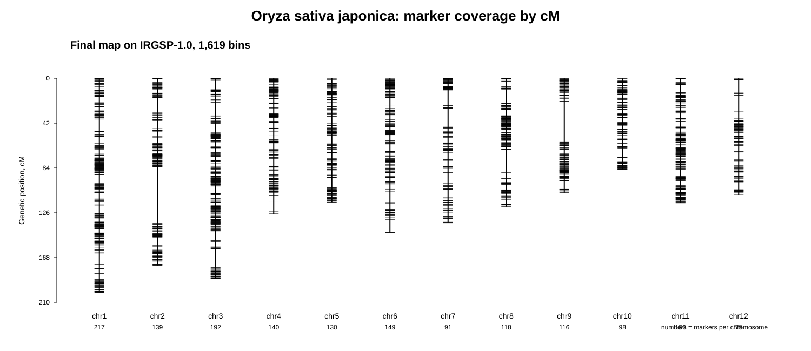
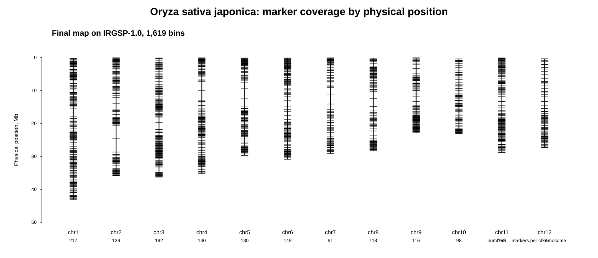
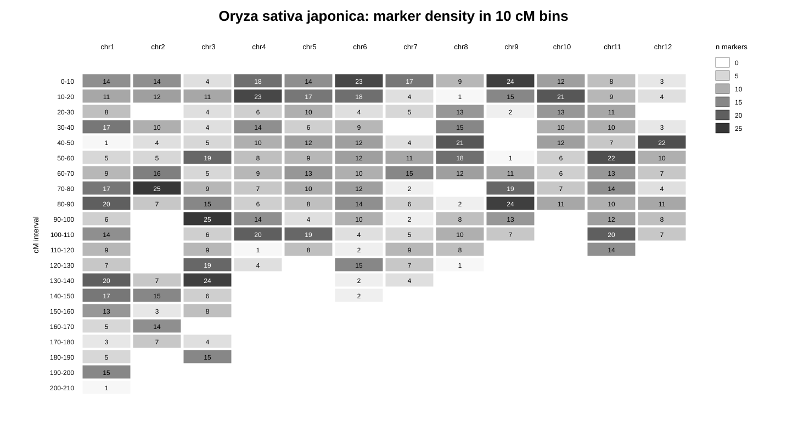

# Oryza sativa japonica: построение генетической карты

## Цель

Для *Oryza sativa japonica* нужно было получить таблицу генетической карты в формате:

~~~text
chr    pos    cM
~~~

где:

- `chr` — номер хромосомы в целевой сборке генома;
- `pos` — физическая координата на целевой сборке;
- `cM` — генетическая координата в сантиморганах.

Целевая сборка генома:

~~~text
GCF_001433935.1_IRGSP-1.0
~~~

Файл генома на сервере:

~~~text
/mnt/reference/genomes/oryza_sativa_japonica/GCF_001433935.1/GCF_001433935.1_IRGSP-1.0_genomic.unmasked.fna
~~~

Файл аннотации:

~~~text
/mnt/reference/genomes/oryza_sativa_japonica/GCF_001433935.1/genomic.gff
~~~

## Источник генетической карты

В качестве источника использовалась опубликованная высокоплотная SNP/bin-карта из статьи:

~~~text
Yu H., Xie W., Wang J., Xing Y., Xu C., Li X., Xiao J., Zhang Q.
Gains in QTL Detection Using an Ultra-High Density SNP Map Based on Population Sequencing Relative to Traditional RFLP/SSR Markers.
PLOS ONE, 2011.
DOI: 10.1371/journal.pone.0017595
URL: https://journals.plos.org/plosone/article?id=10.1371/journal.pone.0017595
~~~

Использованный дополнительный файл:

~~~text
pone.0017595.s004.xls
~~~

Путь к нему в проекте:

~~~text
species/oryza_sativa_japonica/data/raw/public_sources/published_maps/yu_2011_plosone/pone.0017595.s004.xls
~~~

В таблице содержалась карта для 1,619 рекомбинантных интервалов — bins. Для каждого интервала были указаны:

~~~text
bin
chromosme
start
stop
bin_size_mb
genetic_map_cm
~~~

Физические координаты в исходной таблице были заданы относительно старой сборки генома риса:

~~~text
TIGR6.1 / MSU / Nipponbare
~~~

Поэтому для получения карты на целевой сборке IRGSP-1.0 физические координаты были перенесены с TIGR6.1 на IRGSP-1.0.

Генетические координаты `cM` не пересчитывались. Они были взяты из опубликованной карты Yu et al. 2011. В работе переносились только физические координаты.

## Использованные сценарии

Основные сценарии:

~~~text
species/oryza_sativa_japonica/scripts/23_extract_yu2011_bins_from_xls.py
species/oryza_sativa_japonica/scripts/24_make_yu2011_tigr6_direct_map_and_bed.py
species/oryza_sativa_japonica/scripts/25_download_tigr6_reference.sh
species/oryza_sativa_japonica/scripts/25_prepare_yu2011_bed_for_tigr6_fasta.py
species/oryza_sativa_japonica/scripts/26_liftover_yu2011_tigr6_to_irgsp1.sh
species/oryza_sativa_japonica/scripts/27_build_yu2011_irgsp1_final_map.py
species/oryza_sativa_japonica/scripts/28_qc_yu2011_irgsp1_final_map_collinearity.py
~~~

## Извлечение bin-карты из таблицы

Из файла `pone.0017595.s004.xls` была извлечена таблица с 1,619 интервалами:

~~~text
species/oryza_sativa_japonica/data/raw/public_sources/published_maps/yu_2011_plosone/yu2011_bins_tigr6.tsv
~~~

Также была подготовлена BED-таблица, в которой для каждого интервала указана его середина на сборке TIGR6.1:

~~~text
species/oryza_sativa_japonica/data/raw/public_sources/published_maps/yu_2011_plosone/yu2011_bins_tigr6_midpoints.bed
~~~

Поскольку в FASTA-файле TIGR6.1 названия последовательностей имели вид `chr01|13101`, был дополнительно подготовлен BED-файл с такими же названиями, как в FASTA:

~~~text
species/oryza_sativa_japonica/data/raw/public_sources/published_maps/yu_2011_plosone/yu2011_bins_tigr6_midpoints.fasta_seqids.bed
~~~

Ключевые результаты:

~~~text
n_bins      1619
chromosomes 1,2,3,4,5,6,7,8,9,10,11,12
~~~

## Перенос координат с TIGR6.1 на IRGSP-1.0

Для переноса физических координат было выполнено полногеномное выравнивание старой сборки TIGR6.1 на целевую сборку IRGSP-1.0.

Команда внутри сценария:

~~~bash
/mnt/users/tagirovaa/bin/minimap2 \
  -t 6 \
  -cx asm5 \
  /mnt/reference/genomes/oryza_sativa_japonica/GCF_001433935.1/GCF_001433935.1_IRGSP-1.0_genomic.unmasked.fna \
  species/oryza_sativa_japonica/data/raw/references/tigr6/tigr6_pseudomolecules.fa \
  > species/oryza_sativa_japonica/results/liftover/yu2011_tigr6_to_irgsp1/tigr6_to_irgsp1.asm5.paf
~~~

После этого точки из BED-файла были перенесены на новую сборку с помощью `paftools.js liftover`:

~~~bash
/mnt/users/grigorieval/miniconda3/bin/k8 \
  /mnt/users/grigorieval/miniconda3/bin/paftools.js \
  liftover \
  -l 1 \
  species/oryza_sativa_japonica/results/liftover/yu2011_tigr6_to_irgsp1/tigr6_to_irgsp1.asm5.paf \
  species/oryza_sativa_japonica/data/raw/public_sources/published_maps/yu_2011_plosone/yu2011_bins_tigr6_midpoints.fasta_seqids.bed \
  > species/oryza_sativa_japonica/results/liftover/yu2011_tigr6_to_irgsp1/yu2011_bins_irgsp1_lifted.bed
~~~

Основные выходные файлы после переноса координат:

~~~text
species/oryza_sativa_japonica/results/liftover/yu2011_tigr6_to_irgsp1/yu2011_bins_irgsp1_lifted.bed
species/oryza_sativa_japonica/results/liftover/yu2011_tigr6_to_irgsp1/minimap2_tigr6_to_irgsp1.log
species/oryza_sativa_japonica/results/liftover/yu2011_tigr6_to_irgsp1/paftools_liftover.log
species/oryza_sativa_japonica/results/liftover/yu2011_tigr6_to_irgsp1/26_liftover_yu2011_tigr6_to_irgsp1.nohup.log
~~~

PAF-файл использовался как промежуточный файл большого размера, поэтому он не включался в git.

## Сборка итоговой карты

После переноса координаты были присоединены обратно к исходной таблице интервалов и их генетическим координатам `cM`.

Итоговая таблица:

~~~text
species/oryza_sativa_japonica/results/final/oryza_sativa_japonica_genetic_map.tsv
~~~

Файл с расширенной информацией для проверки:

~~~text
species/oryza_sativa_japonica/results/final/oryza_sativa_japonica_genetic_map.details.tsv
~~~

Формат итоговой таблицы:

~~~text
chr    pos    cM
~~~

## Проверка качества результата

Основные файлы с результатами проверки:

~~~text
species/oryza_sativa_japonica/results/qc/yu2011_irgsp1_liftover_final_map_summary.txt
species/oryza_sativa_japonica/results/qc/yu2011_irgsp1_liftover_final_map_by_chr.tsv
species/oryza_sativa_japonica/results/qc/yu2011_irgsp1_final_map_collinearity_qc.tsv
~~~

Ключевые результаты:

~~~text
original_bed_rows       1619
lifted_rows             1619
final_map_rows          1619
chromosomes             1,2,3,4,5,6,7,8,9,10,11,12
same_chr_as_source      1619
duplicate_chr_pos       0
~~~

Все 1,619 точек были успешно перенесены на целевую сборку. Для всех интервалов номер хромосомы после переноса совпал с номером хромосомы в исходной таблице. Повторяющихся пар `chr:pos` не обнаружено.

Проверка согласованности физической и генетической карт показала, что при сортировке по физической координате `pos` на каждой хромосоме генетическая координата `cM` возрастает монотонно. Это означает, что порядок точек после переноса координат сохранился корректно.

Итоговая таблица по хромосомам:

| chr | n_bins | cM_min | cM_max |
|---:|---:|---:|---:|
| 1 | 217 | 0.000000 | 200.606253 |
| 2 | 139 | 0.000000 | 175.413532 |
| 3 | 192 | 0.000000 | 187.487722 |
| 4 | 140 | 0.000000 | 127.237149 |
| 5 | 130 | 0.000000 | 116.043092 |
| 6 | 149 | 0.000000 | 144.412563 |
| 7 | 91 | 0.000000 | 135.407854 |
| 8 | 118 | 0.000000 | 120.351252 |
| 9 | 116 | 0.000000 | 107.159809 |
| 10 | 98 | 0.000000 | 85.333908 |
| 11 | 150 | 0.000000 | 116.721616 |
| 12 | 79 | 0.000000 | 109.333493 |

## Итог

Для *Oryza sativa japonica* была получена генетическая карта на целевой сборке IRGSP-1.0:

~~~text
species/oryza_sativa_japonica/results/final/oryza_sativa_japonica_genetic_map.tsv
~~~

Файл содержит:

~~~text
1619 строк с данными
12 хромосом
0 повторяющихся координат chr:pos
0 участков с уменьшением cM
~~~

## Визуализация итоговой карты

Ниже приведены графики для итоговой карты *Oryza sativa japonica* на сборке IRGSP-1.0.

### Покрытие генетической карты по cM

### Покрытие физической карты по координатам

### Плотность маркеров в интервалах по 10 cM

Таблица с плотностью маркеров:

~~~text
species/oryza_sativa_japonica/results/qc/oryza_sativa_japonica_marker_density_10cM_bins.tsv