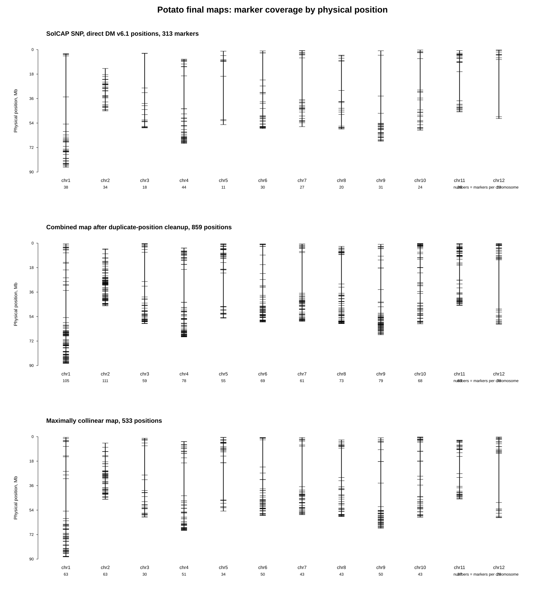
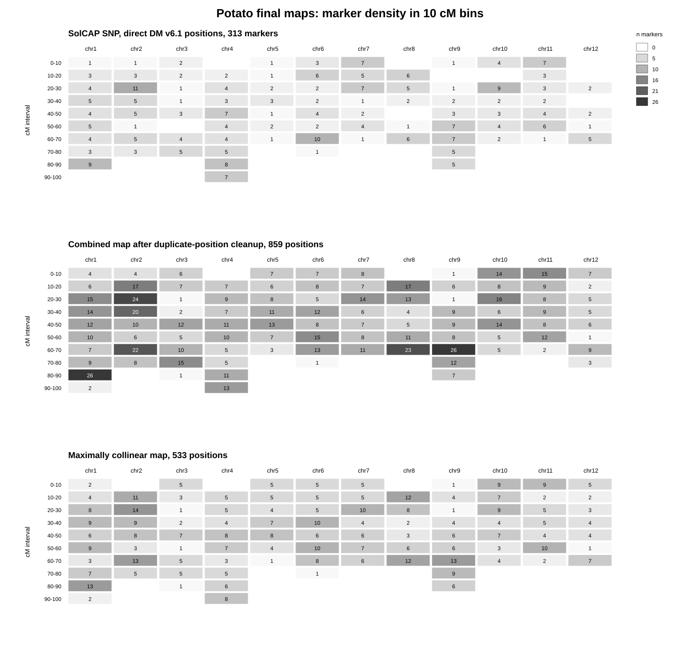

# Картофель: построение генетической карты

## Цель

Для картофеля требовалось получить таблицу генетической карты в формате:

~~~text
chr    pos    cM
~~~

где:

- `chr` — номер хромосомы в актуальной сборке картофеля;
- `pos` — физическая позиция маркера на референсном геноме;
- `cM` — генетическая координата маркера в сантиморганах.

Целевой референсный геном:

~~~text
DM_1-3_516_R44_potato.v6.1
~~~

На сервере целевой референс был расположен по пути:

~~~text
/mnt/reference/genomes/solanum_tuberosum/DM_1-3_516_R44_potato.v6.1.fa
~~~

## Исходные данные и общая логика работы

Для картофеля использовались два основных источника данных.

Первый источник — supplementary Table S4 из работы Sharma et al. 2013:

~~~text
species/solanum_tuberosum/data/raw/pgsc_sharma_2013/TableS4.tsv
~~~

Эта таблица содержала маркеры генетической карты и их генетические координаты в сантиморганах. При этом физические координаты маркеров в Table S4 были указаны не на новой сборке, а на старой сборке картофеля:

~~~text
PGSC/DM v4.03
~~~

Второй источник — таблицы SpudDB с физическими координатами SNP на целевой сборке:

~~~text
DM_1-3_516_R44_potato.v6.1
~~~

Файлы SpudDB:

~~~text
species/solanum_tuberosum/data/raw/spuddb_dm_v6_1/solcap_69k_SNPs_DM_v6_1_pos.txt.gz
species/solanum_tuberosum/data/raw/spuddb_dm_v6_1/potvar_SNPs_DM_v6_1_pos.txt.gz
species/solanum_tuberosum/data/raw/spuddb_dm_v6_1/solcap_69k_potvar_SNP_pos_DM_v6_1.xlsx
~~~

Таким образом, ни один источник сам по себе не давал готовую таблицу `chr pos cM` для новой сборки. Поэтому данные были объединены по следующей логике:

~~~text
Table S4
→ источник генетических координат cM

SpudDB DM v6.1 SNP tables
→ источник физических координат chr и pos для SolCAP SNP на новой сборке

Перенос координат между сборками
→ способ получить chr и pos на новой сборке для остальных маркеров Table S4
~~~

Итоговая стратегия была такой:

~~~text
SolCAP SNP
→ cM из Table S4
→ chr и pos напрямую из SpudDB DM v6.1

DArT_marker / repeat_region / match
→ cM из Table S4
→ физическая позиция на старой сборке из Table S4
→ новая физическая позиция на DM v6.1 через перенос координат между сборками
~~~

## Извлечение генетических координат из Table S4

Генетические координаты маркеров были извлечены из `TableS4.tsv` скриптом:

~~~text
species/solanum_tuberosum/scripts/04_parse_potato_genetic_map_tableS4.py
~~~

Table S4 была представлена в GFF-подобном формате. Для каждого маркера в ней были указаны:

- идентификатор маркера;
- тип маркера;
- физические координаты на старой сборке `PGSC/DM v4.03`;
- генетическая хромосома;
- генетическая координата `cM`.

Генетическая позиция была записана в поле attributes, например:

~~~text
Genetic position = Chr01 8.698 cM
~~~

Скрипт извлекал из Table S4 следующие данные:

~~~text
marker_id
marker_type
old_seqid
old_start
old_end
genetic_chr
cM
~~~

Всего из Table S4 было извлечено:

~~~text
1730 маркеров
~~~

Распределение по типам маркеров:

~~~text
DArT_marker      1305
SNP               313
repeat_region      80
match              32
~~~

Записи типа `SNP` соответствовали SolCAP SNP-маркерам. Для них в дальнейшем можно было использовать прямые физические координаты на новой сборке из SpudDB.

Остальные типы маркеров не имели готовых физических координат на DM v6.1 в SpudDB. Поэтому для них использовались координаты на старой сборке из Table S4, которые затем переносились на новую сборку.

## Подготовка физических координат SolCAP SNP на DM v6.1

Для SolCAP SNP были доступны прямые физические координаты на целевой сборке `DM_1-3_516_R44_potato.v6.1` в таблицах SpudDB.

Файлы SpudDB были загружены скриптом:

~~~text
species/solanum_tuberosum/scripts/01_download_potato_sources.sh
~~~

Подготовка физических координат выполнялась скриптом:

~~~text
species/solanum_tuberosum/scripts/02_prepare_potato_physical_positions.py
~~~

Текстовые таблицы SpudDB имели колонки следующего типа:

~~~text
SNP_ID    REF    SNP_POS    NUM_MISMATCH    MULTIMAP
~~~

где:

- `SNP_ID` — идентификатор SNP-маркера;
- `REF` — хромосома или последовательность на сборке DM v6.1;
- `SNP_POS` — физическая позиция SNP на сборке DM v6.1;
- `NUM_MISMATCH` — число несовпадений при сопоставлении SNP с референсом;
- `MULTIMAP` — признак того, что SNP может сопоставляться с несколькими позициями генома.

Скрипт объединил SpudDB-таблицы и сформировал несколько промежуточных файлов:

~~~text
species/solanum_tuberosum/results/intermediate/potato_physical_positions.all.tsv
species/solanum_tuberosum/results/intermediate/potato_physical_positions.unique.tsv
species/solanum_tuberosum/results/intermediate/potato_physical_positions.strict_exact.tsv
~~~

Файл `potato_physical_positions.all.tsv` содержит все считанные SNP-позиции из SpudDB-источников.

Файл `potato_physical_positions.unique.tsv` содержит SNP без признака множественного сопоставления:

~~~text
MULTIMAP == N
~~~

То есть такие SNP имеют одну однозначную позицию на сборке DM v6.1.

Файл `potato_physical_positions.strict_exact.tsv` содержит самый строгий набор SNP:

~~~text
MULTIMAP == N
NUM_MISMATCH == 0
~~~

Это означает, что SNP был однозначно сопоставлен с одной позицией на референсе DM v6.1 и не имел несовпадений относительно целевой сборки.

Итоговая статистика по физическим координатам SNP:

~~~text
Input rows total: 86115
Unique-position rows, MULTIMAP == N: 81711
Strict exact rows, MULTIMAP == N and NUM_MISMATCH == 0: 45462
Duplicated marker_id among MULTIMAP == N rows: 0
~~~

Далее физические координаты SpudDB были сопоставлены с SolCAP SNP из Table S4. В Table S4 эти маркеры были записаны как:

~~~text
solcap_stsnp_*
~~~

а в SpudDB — как:

~~~text
solcap_snp_*
~~~

Поэтому перед объединением была выполнена нормализация имен:

~~~text
solcap_stsnp_*  →  solcap_snp_*
~~~

После такой нормализации все 313 SolCAP SNP из Table S4 были найдены в SpudDB-таблицах. Для этих маркеров итоговые значения брались из двух источников:

~~~text
cM        → из Table S4
chr, pos  → из SpudDB DM v6.1 SNP tables
~~~

Таким образом, для SolCAP SNP не требовалось переносить физические координаты со старой сборки: их актуальные координаты на DM v6.1 уже были доступны в SpudDB.

## Строгая карта по прямым координатам SolCAP SNP

Первый вариант карты был построен только по SolCAP SNP, для которых были доступны прямые физические координаты на целевой сборке DM v6.1.

Использовался скрипт:

~~~text
species/solanum_tuberosum/scripts/05_finalize_potato_map.py
~~~

Итоговый файл:

~~~text
species/solanum_tuberosum/results/final/potato_genetic_map.tsv
~~~

Расширенная версия с идентификаторами маркеров:

~~~text
species/solanum_tuberosum/results/final/potato_genetic_map.with_markers.tsv
~~~

Характеристики этой карты:

~~~text
Количество строк: 313
Хромосомы: 1–12
Формат: chr, pos, cM
~~~

Эта карта является самым консервативным результатом, так как использует только SolCAP SNP с прямыми физическими координатами на целевой сборке и строгими критериями сопоставления.

## Перенос координат остальных маркеров на DM v6.1

После построения карты по SolCAP SNP оставалась большая часть маркеров из Table S4, для которых не было прямых физических координат на новой сборке DM v6.1. К ним относились в основном:

~~~text
DArT_marker
repeat_region
match
~~~

Для этих маркеров Table S4 содержала генетическую координату `cM` и физическую координату на старой сборке `PGSC/DM v4.03`. Чтобы использовать эти маркеры в итоговой карте, их физические координаты нужно было перенести на сборку `DM_1-3_516_R44_potato.v6.1`.

Общая схема была следующей:

~~~text
Table S4
→ marker_id + cM + позиция на PGSC/DM v4.03

Выравнивание старой и новой сборок
→ связь координат между PGSC/DM v4.03 и DM v6.1

Перенос координат
→ marker_id + cM + позиция на DM v6.1
~~~

### Подготовка файлов для переноса координат

Перед выравниванием были подготовлены FASTA-файлы старой и новой сборок.

Подготовка выполнялась скриптом:

~~~text
species/solanum_tuberosum/scripts/06_prepare_potato_liftover_references_cluster.sh
~~~

Задачи этого скрипта:

1. получить или распаковать FASTA старой сборки `PGSC/DM v4.03`;
2. проверить путь к FASTA новой сборки `DM_1-3_516_R44_potato.v6.1` на сервере;
3. сохранить пути к обеим сборкам для следующего шага.

В результате были определены два основных файла:

~~~text
OLD_FA = PGSC_DM_v4.03_pseudomolecules.fasta
NEW_FA = /mnt/reference/genomes/solanum_tuberosum/DM_1-3_516_R44_potato.v6.1.fa
~~~

В терминах выравнивания старая сборка была query, а новая сборка — target:

~~~text
query  = PGSC_DM_v4.03_pseudomolecules.fasta
target = DM_1-3_516_R44_potato.v6.1.fa
~~~

Такой порядок был выбран потому, что координаты маркеров в Table S4 заданы на старой сборке, а получить нужно было координаты на новой.

### Выравнивание старой и новой сборок

Выравнивание старой сборки на новую выполнялось скриптом:

~~~text
species/solanum_tuberosum/scripts/07_align_potato_v403_to_v61_minimap2_cluster.sh
~~~

Для этого использовался `minimap2`, так как он подходит для сравнения больших геномных последовательностей: хромосом, псевдомолекул и разных версий сборки одного организма.

Команда использовала режим выравнивания близких сборок:

~~~text
minimap2 -x asm5 -c --cs=long --secondary=no target.fa query.fa > output.paf
~~~

В нашем случае:

~~~text
target.fa = DM_1-3_516_R44_potato.v6.1.fa
query.fa  = PGSC_DM_v4.03_pseudomolecules.fasta
~~~

Флаги команды:

~~~text
-x asm5
~~~

Режим для выравнивания близких геномных сборок. Он подходит для сравнения разных сборок одного организма.

~~~text
-c
~~~

Добавляет в PAF-вывод тег CIGAR `cg:Z`. Этот тег описывает, как именно участок старой сборки выровнен на участок новой сборки внутри блока выравнивания. Он нужен для точного переноса координат отдельных маркеров.

~~~text
--cs=long
~~~

Добавляет подробный тег `cs:Z`, описывающий совпадения, замены, вставки и делеции на уровне последовательности. Для основного переноса координат использовался тег `cg:Z`, а `cs:Z` сохранялся как дополнительная информация о выравнивании.

~~~text
--secondary=no
~~~

Отключает вывод вторичных выравниваний. Это уменьшает неоднозначность при переносе координат, так как для каждой области предпочтительно использовать основное лучшее соответствие между сборками.

Ключевым результатом этого этапа был PAF-файл с выравниванием старой сборки на новую.

### Перенос координат с учетом CIGAR

Перенос координат маркеров из Table S4 со старой сборки на новую выполнялся скриптом:

~~~text
species/solanum_tuberosum/scripts/09_liftover_potato_TableS4_v403_to_v61_cigar.py
~~~

PAF-файл дает соответствие между блоками старой и новой сборок. Однако только границ блока недостаточно для точного переноса конкретной позиции, потому что внутри блока могут быть вставки, делеции и небольшие различия между сборками.

Поэтому использовался тег CIGAR:

~~~text
cg:Z
~~~

CIGAR — это компактная запись того, как участок старой сборки выровнен на участок новой сборки. Например:

~~~text
100M3I50M2D80M
~~~

где:

~~~text
100M  100 позиций выровнены
3I    3 позиции есть в query, но отсутствуют в target
50M   еще 50 позиций выровнены
2D    2 позиции есть в target, но отсутствуют в query
80M   еще 80 позиций выровнены
~~~

За счет CIGAR можно не просто приблизительно пересчитать координату внутри блока, а пройти по выравниванию пошагово и определить, какой позиции на новой сборке соответствует конкретная позиция на старой сборке.

Для каждого маркера из Table S4 скрипт использовал:

~~~text
old_seqid
old_start
old_end
old_midpoint
cM
marker_id
marker_type
~~~

Если маркер был представлен интервалом, для переноса использовалась центральная точка интервала:

~~~text
old_midpoint = середина между old_start и old_end
~~~

Далее выполнялись шаги:

1. найти PAF-блок, покрывающий `old_midpoint` на старой сборке;
2. определить, на какую последовательность новой сборки выровнен этот блок;
3. с помощью `cg:Z` перенести координату `old_midpoint` на новую сборку;
4. получить новую физическую координату;
5. проверить, совпадает ли хромосома после переноса с хромосомой генетической карты;
6. сохранить результат в таблицу.

Схема переноса:

~~~text
Table S4:
marker_id
позиция на PGSC/DM v4.03
cM

PAF + CIGAR:
соответствие старой позиции новой позиции

Output:
marker_id
chr
pos на DM v6.1
cM
~~~

Результаты переноса координат:

~~~text
Input TableS4 markers: 1730
lifted_chr_agree: 1688
lifted_chr_disagree: 32
cigar_no_exact_target_base: 7
no_covering_paf_block: 3
~~~

Значения означают:

~~~text
lifted_chr_agree
~~~

Маркер был успешно перенесен на новую сборку, и хромосома после переноса совпала с хромосомой генетической карты.

~~~text
lifted_chr_disagree
~~~

Маркер был перенесен, но хромосома после переноса не совпала с хромосомой генетической карты. Такие записи не использовались для высоконадежной карты.

~~~text
cigar_no_exact_target_base
~~~

Маркер попадал в участок выравнивания, где по CIGAR нельзя было однозначно указать соответствующую позицию на новой сборке, например из-за вставки относительно новой сборки.

~~~text
no_covering_paf_block
~~~

Для позиции маркера не был найден блок выравнивания, покрывающий эту координату на старой сборке.

Расширенная карта после переноса координат была сохранена в файл:

~~~text
species/solanum_tuberosum/results/final/potato_genetic_map.liftover_extended_cigar.tsv
~~~

Расширенная версия с идентификаторами маркеров:

~~~text
species/solanum_tuberosum/results/final/potato_genetic_map.liftover_extended_cigar.with_markers.tsv
~~~

Количество уникальных строк `chr-pos-cM` в этой карте:

~~~text
1240
~~~

### Проверка точности переноса координат

Для проверки точности переноса координат использовались SolCAP SNP. Это удобно, потому что для них были доступны два независимых варианта физических координат на новой сборке:

~~~text
1. координаты, полученные переносом со старой сборки;
2. прямые координаты SpudDB на DM v6.1.
~~~

Сравнение показало, что большинство SolCAP SNP после переноса совпали с прямыми SpudDB-координатами или отличались незначительно. Это подтвердило, что подход с выравниванием сборок и переносом координат с учетом CIGAR работает корректно.

Однако для финальной карты SolCAP SNP были взяты не из переноса, а напрямую из SpudDB. Это было сделано потому, что прямые координаты SNP на целевой сборке считаются более надежными, чем координаты, восстановленные через перенос между сборками.

## Объединенная высоконадежная карта

После переноса координат была построена объединенная высоконадежная карта.

Логика построения:

1. SolCAP SNP брались из прямых координат SpudDB на DM v6.1.
2. Остальные маркеры Table S4 брались из переноса координат с учетом CIGAR.
3. Для перенесенных маркеров применялись строгие фильтры качества.

Фильтры для перенесенных маркеров:

~~~text
liftover_status == lifted_chr_agree
cigar_status == cigar_aligned_base
target_type == chromosome
MAPQ >= 60
paf_identity >= 0.95
n_liftover_candidates == 1
~~~

Эти условия означали, что маркер был перенесен на хромосомную последовательность, совпал с хромосомой генетической карты, имел высокое качество выравнивания и единственный подходящий вариант переноса.

Скрипт:

~~~text
species/solanum_tuberosum/scripts/10_build_potato_hybrid_high_confidence_map.py
~~~

Результат:

~~~text
species/solanum_tuberosum/results/final/potato_genetic_map.hybrid_high_confidence.tsv
~~~

Расширенная версия с идентификаторами маркеров:

~~~text
species/solanum_tuberosum/results/final/potato_genetic_map.hybrid_high_confidence.with_markers.tsv
~~~

Характеристики объединенной высоконадежной карты:

~~~text
SolCAP SNP из прямого SpudDB-сопоставления: 313
Дополнительные маркеры из переноса координат: 1327
Всего строк с маркерами: 1640
Уникальных chr-pos-cM строк: 1209
~~~

Распределение строк по типам маркеров:

~~~text
DArT_marker      1223
SNP               313
repeat_region      74
match              30
~~~

## Удаление повторяющихся физических позиций

В объединенной высоконадежной карте несколько разных маркеров могли попадать в одну и ту же физическую позицию `chr:pos`, но иметь разные значения `cM`. Для итоговой таблицы было решено оставить только одно значение `cM` для каждой физической позиции.

Использовалось правило первого значения `cM`: если одной физической позиции соответствовало несколько значений `cM`, сохранялось первое значение из таблицы с маркерами. Медиана и усреднение не применялись.

Скрипт:

~~~text
species/solanum_tuberosum/scripts/14_build_potato_first_cM_hybrid_map_and_qc.py
~~~

Результат:

~~~text
species/solanum_tuberosum/results/final/potato_genetic_map.hybrid_high_confidence.first_cM.tsv
~~~

Расширенная версия с информацией о выбранных маркерах:

~~~text
species/solanum_tuberosum/results/final/potato_genetic_map.hybrid_high_confidence.first_cM.with_metadata.tsv
~~~

Характеристики карты после удаления повторяющихся физических позиций:

~~~text
Строк с маркерами до удаления повторов: 1640
Уникальных физических позиций после обработки: 859
Физических позиций с несколькими значениями cM до обработки: 152
~~~

Проверка показала, что в этой карте не осталось дубликатов `chr:pos`.

Распределение позиций по хромосомам:

~~~text
chr1     105
chr2     111
chr3      59
chr4      78
chr5      55
chr6      69
chr7      61
chr8      73
chr9      79
chr10     68
chr11     63
chr12     38
~~~

## Визуализация покрытия и плотности маркеров

Для наглядной проверки итоговых карт были построены три графика. Они сравнивают три версии карты:

~~~text
1. строгая карта по SolCAP SNP с прямыми координатами на DM v6.1 — 313 маркеров;
2. объединенная карта после удаления повторяющихся физических позиций — 859 позиций;
3. максимально коллинеарная карта — 533 позиции.
~~~

Первый график показывает покрытие хромосом маркерами по генетической координате `cM`. Каждая вертикальная линия соответствует хромосоме, а короткие горизонтальные штрихи показывают положение маркеров на генетической карте. Числа под хромосомами показывают количество маркеров на каждой хромосоме.

Второй график показывает покрытие хромосом маркерами по физической позиции на сборке `DM_1-3_516_R44_potato.v6.1`. Он позволяет оценить, насколько равномерно маркеры распределены вдоль физических хромосом.

Третий график показывает плотность маркеров в интервалах по 10 cM. Более темные ячейки соответствуют интервалам с большим числом маркеров. Этот график помогает увидеть участки генетической карты с высокой и низкой плотностью маркеров.

Таблица с численными значениями плотности маркеров была сохранена в файл:

~~~text
species/solanum_tuberosum/results/qc/potato_marker_density_10cM_bins.tsv
~~~

## Проверка коллинеарности

Для оценки качества карты была проведена проверка согласованности между физическими координатами `pos` и генетическими координатами `cM`.

Использовались скрипты:

~~~text
species/solanum_tuberosum/scripts/11_qc_potato_collinearity.py
species/solanum_tuberosum/scripts/14_build_potato_first_cM_hybrid_map_and_qc.py
~~~

Для большинства хромосом наблюдалась сильная положительная корреляция между `pos` и `cM`. Хромосома 12 имела обратную ориентацию:

~~~text
chr12 Spearman(pos, cM): -0.981343
~~~

Такая же обратная ориентация наблюдалась уже в строгой SolCAP-карте. Поэтому это было интерпретировано как различие ориентации между генетической картой и физической ориентацией хромосомы 12 в текущей сборке, а не как ошибка переноса координат.

## Максимально коллинеарная карта

Для получения максимально коллинеарной версии была выполнена дополнительная фильтрация карты после удаления повторяющихся физических позиций.

Внутри каждой хромосомы маркеры сортировались по физической координате `pos`.

Далее:

- для хромосом с положительной корреляцией `pos ~ cM` сохранялась самая длинная неубывающая последовательность `cM`;
- для хромосомы 12, имеющей обратную ориентацию, сохранялась самая длинная невозрастающая последовательность `cM`;
- значения `cM` не изменялись;
- удалялись только локально неколлинеарные позиции.

Скрипт:

~~~text
species/solanum_tuberosum/scripts/15_build_potato_max_collinear_map.py
~~~

Итоговая максимально коллинеарная карта:

~~~text
species/solanum_tuberosum/results/final/potato_genetic_map.hybrid_high_confidence.first_cM.max_collinear.tsv
~~~

Расширенная версия с информацией о выбранных маркерах:

~~~text
species/solanum_tuberosum/results/final/potato_genetic_map.hybrid_high_confidence.first_cM.max_collinear.with_metadata.tsv
~~~

Файл с удаленными позициями:

~~~text
species/solanum_tuberosum/results/qc/potato_max_collinear_removed_positions.tsv
~~~

Сводка контроля качества:

~~~text
species/solanum_tuberosum/results/qc/potato_max_collinear_summary.txt
~~~

Характеристики максимально коллинеарной карты:

~~~text
Строк до фильтрации: 859
Оставлено строк: 533
Удалено строк: 326
~~~

Распределение маркеров по хромосомам:

~~~text
chr1     63
chr2     63
chr3     30
chr4     51
chr5     34
chr6     50
chr7     43
chr8     43
chr9     50
chr10    43
chr11    37
chr12    26
~~~

Всего:

~~~text
533 строки
~~~

После фильтрации коллинеарность стала практически идеальной:

~~~text
chr1–chr11: положительная ориентация, Spearman примерно 0.9995–1.0000
chr12: обратная ориентация, Spearman -0.999829
~~~

Итоговый файл имеет требуемый формат:

~~~text
chr    pos    cM
~~~

## Итоговые файлы

Строгая карта по SolCAP SNP с прямыми координатами на DM v6.1:

~~~text
species/solanum_tuberosum/results/final/potato_genetic_map.tsv
~~~

Объединенная карта после удаления повторяющихся физических позиций:

~~~text
species/solanum_tuberosum/results/final/potato_genetic_map.hybrid_high_confidence.first_cM.tsv
~~~

Максимально коллинеарная карта:

~~~text
species/solanum_tuberosum/results/final/potato_genetic_map.hybrid_high_confidence.first_cM.max_collinear.tsv
~~~

Расширенная версия максимально коллинеарной карты:

~~~text
species/solanum_tuberosum/results/final/potato_genetic_map.hybrid_high_confidence.first_cM.max_collinear.with_metadata.tsv
~~~

Файл с удаленными при фильтрации позициями:

~~~text
species/solanum_tuberosum/results/qc/potato_max_collinear_removed_positions.tsv
~~~

Сводка контроля качества для максимально коллинеарной карты:

~~~text
species/solanum_tuberosum/results/qc/potato_max_collinear_summary.txt
~~~

## Вывод

Для картофеля была построена строгая карта на основе SolCAP SNP с прямыми координатами на сборке `DM_1-3_516_R44_potato.v6.1`. Для увеличения плотности карты были также использованы остальные маркеры из Table S4: их координаты были перенесены со старой сборки `PGSC/DM v4.03` на новую сборку с помощью выравнивания двух сборок и переноса координат с учетом CIGAR.

В итоговой объединенной карте SolCAP SNP брались из прямых координат SpudDB, а остальные маркеры — из переноса координат. Затем одинаковые физические позиции `chr:pos` были обработаны по правилу первого значения `cM`, а полученная карта была дополнительно отфильтрована для максимальной коллинеарности.

В качестве основного расширенного результата рекомендуется файл:

~~~text
species/solanum_tuberosum/results/final/potato_genetic_map.hybrid_high_confidence.first_cM.max_collinear.tsv
~~~

Он содержит 533 строки, охватывает все 12 хромосом картофеля и имеет требуемый формат `chr pos cM`.
